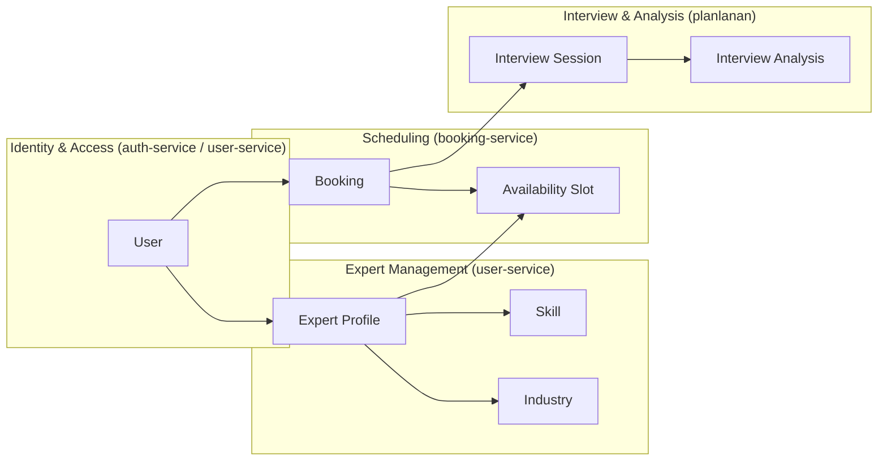
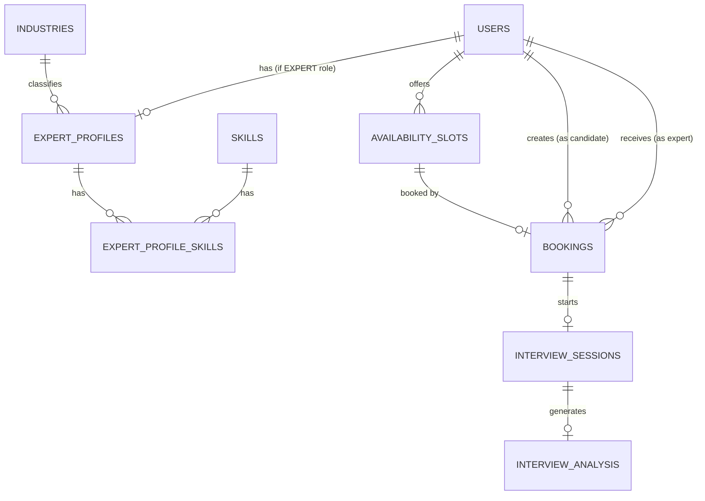
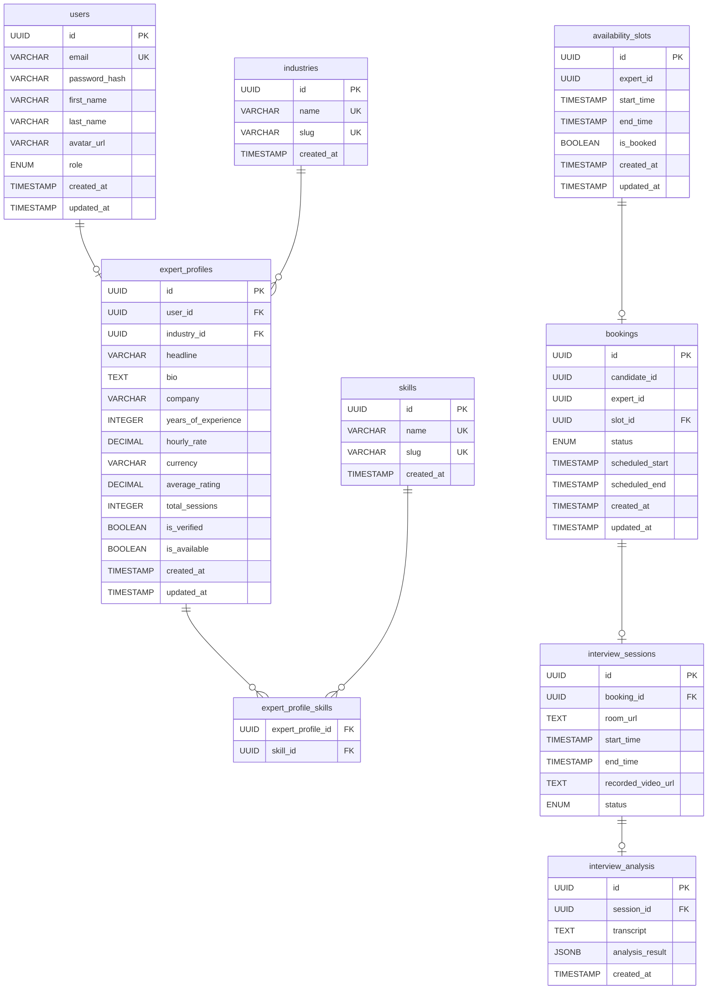

# Domain Model

## 3.1 Domain Overview

Internview'in domain modeli, bir adayın platforma kaydolmasından, uzman ile mülakat yapıp AI destekli performans raporu almasına kadarki tüm iş sürecini kapsayan entity'lerden oluşur.

> **Not:** Bu döküman mevcut koddaki implementasyonu yansıtır. `InterviewSession` ve `InterviewAnalysis` entity'leri roadmap'te **planlanan** olarak işaretlidir ve henüz implemente edilmemiştir; bu bölümler ileride hayata geçecek tasarımı gösterir.

### Ana Kavramlar (Bounded Contexts)



---

## 3.2 Core Entities

### User

Sistemdeki tüm kullanıcıları temsil eder. Rol bilgisi tek bir enum alanında tutulur (`CANDIDATE`, `EXPERT`, `ADMIN`); bir kullanıcının birden fazla rolü olamaz.

| Alan | Tip | Açıklama |
|------|-----|----------|
| `id` | `UUID` | Benzersiz kullanıcı kimliği (Primary Key) |
| `email` | `VARCHAR(255)` | Kullanıcı e-posta adresi (Unique) |
| `password_hash` | `VARCHAR` | BCrypt ile hashlenmiş parola |
| `first_name` | `VARCHAR(100)` | Ad |
| `last_name` | `VARCHAR(100)` | Soyad |
| `avatar_url` | `VARCHAR(512)` | Profil fotoğrafı URL'i (nullable) |
| `role` | `ENUM` | `CANDIDATE`, `EXPERT`, `ADMIN` |
| `created_at` | `TIMESTAMP` | Oluşturulma tarihi |
| `updated_at` | `TIMESTAMP` | Son güncelleme tarihi |

**Kod referansı:** `backend/user-service/.../domain/User.java`, `UserRole.java`

### ExpertProfile

Uzman rolüne sahip kullanıcıların detaylı profil bilgilerini içerir. Bir uzmanın tek bir sektörü (`industry`), birden fazla `skill`'i olabilir.

| Alan | Tip | Açıklama |
|------|-----|----------|
| `id` | `UUID` | Primary Key |
| `user_id` | `UUID` | FK → `users.id` (One-to-One, unique) |
| `industry_id` | `UUID` | FK → `industries.id` (Many-to-One, nullable) |
| `headline` | `VARCHAR(160)` | Kısa başlık (Sr. Backend Engineer @ Google) |
| `bio` | `TEXT` | Uzman biyografisi |
| `company` | `VARCHAR(160)` | Çalıştığı şirket |
| `years_of_experience` | `INTEGER` | Toplam deneyim yılı |
| `hourly_rate` | `DECIMAL(10,2)` | Saatlik ücret (nullable) |
| `currency` | `VARCHAR(3)` | ISO 4217 para birimi kodu (örn. `USD`, `TRY`) |
| `average_rating` | `DECIMAL(3,2)` | Ortalama değerlendirme puanı (0.00 – 5.00) |
| `total_sessions` | `INTEGER` | Tamamlanmış toplam oturum sayısı |
| `is_verified` | `BOOLEAN` | Uzman doğrulandı mı? |
| `is_available` | `BOOLEAN` | Yeni rezervasyonlara açık mı? |
| `created_at` | `TIMESTAMP` | Oluşturulma tarihi |
| `updated_at` | `TIMESTAMP` | Son güncelleme tarihi |

**Kod referansı:** `backend/user-service/.../domain/ExpertProfile.java`

### Skill

Uzmanların sahip olduğu teknik yetenekleri temsil eder (Many-to-Many).

| Alan | Tip | Açıklama |
|------|-----|----------|
| `id` | `UUID` | Primary Key |
| `name` | `VARCHAR(100)` | Yetenek adı: Java, React, Flutter, System Design vb. (Unique) |
| `slug` | `VARCHAR(120)` | URL-safe kısa ad (Unique) |
| `created_at` | `TIMESTAMP` | Oluşturulma tarihi |

**Ara Tablo — `expert_profile_skills`:**

| Alan | Tip | Açıklama |
|------|-----|----------|
| `expert_profile_id` | `UUID` | FK → `expert_profiles.id` |
| `skill_id` | `UUID` | FK → `skills.id` |

### Industry

Uzmanların uzmanlık sektörünü tanımlar. ExpertProfile → Industry ilişkisi **Many-to-One**'dır (bir uzman tek bir sektöre bağlıdır).

| Alan | Tip | Açıklama |
|------|-----|----------|
| `id` | `UUID` | Primary Key |
| `name` | `VARCHAR(100)` | Sektör adı: Fintech, E-Commerce, HealthTech vb. (Unique) |
| `slug` | `VARCHAR(120)` | URL-safe kısa ad (Unique) |
| `created_at` | `TIMESTAMP` | Oluşturulma tarihi |

**Kod referansı:** `backend/user-service/.../domain/Skill.java`, `Industry.java`

### AvailabilitySlot

Uzmanların müsait oldukları zaman aralıklarını tanımlar. `booking-service` içinde yer alır ve `expert_id` cross-service bir `UUID` referansı olarak tutulur (FK constraint yoktur, servis sınırı gereği).

| Alan | Tip | Açıklama |
|------|-----|----------|
| `id` | `UUID` | Primary Key |
| `expert_id` | `UUID` | Uzman kullanıcının `users.id`'si (cross-service referans) |
| `start_time` | `TIMESTAMP` | Slot başlangıç zamanı (UTC) |
| `end_time` | `TIMESTAMP` | Slot bitiş zamanı (UTC) |
| `is_booked` | `BOOLEAN` | Slot rezerve edildi mi? (Default: `false`) |
| `created_at` | `TIMESTAMP` | Oluşturulma tarihi |
| `updated_at` | `TIMESTAMP` | Son güncelleme tarihi |

**Kod referansı:** `backend/booking-service/.../domain/AvailabilitySlot.java`

### Booking

Aday ile uzman arasındaki randevuyu temsil eder. Slot başlangıç/bitiş zamanı snapshot olarak booking üzerine kopyalanır (`scheduled_start`, `scheduled_end`); slot silinse dahi rezervasyonun tarih bilgisi kaybolmaz.

| Alan | Tip | Açıklama |
|------|-----|----------|
| `id` | `UUID` | Primary Key |
| `candidate_id` | `UUID` | Randevu alan adayın `users.id`'si (cross-service referans) |
| `expert_id` | `UUID` | Randevu verilen uzmanın `users.id`'si (cross-service referans) |
| `slot_id` | `UUID` | FK → `availability_slots.id` (Unique — bir slot tek booking'e bağlanır) |
| `status` | `ENUM` | `PENDING` → `CONFIRMED` → `COMPLETED` / `CANCELLED` |
| `scheduled_start` | `TIMESTAMP` | Rezervasyon başlangıç anı (slot'tan kopyalanır) |
| `scheduled_end` | `TIMESTAMP` | Rezervasyon bitiş anı (slot'tan kopyalanır) |
| `created_at` | `TIMESTAMP` | Randevu oluşturulma zamanı |
| `updated_at` | `TIMESTAMP` | Son güncelleme tarihi |

**Kod referansı:** `backend/booking-service/.../domain/Booking.java`, `BookingStatus.java`

### InterviewSession *(planlanan — henüz implemente edilmedi)*

Bir randevunun gerçekleşen mülakat oturumunu temsil eder.

| Alan | Tip | Açıklama |
|------|-----|----------|
| `id` | `UUID` | Primary Key |
| `booking_id` | `UUID` | FK → `bookings.id` (One-to-One) |
| `room_url` | `TEXT` | WebRTC oda bağlantı adresi |
| `start_time` | `TIMESTAMP` | Oturum başlangıç zamanı |
| `end_time` | `TIMESTAMP` | Oturum bitiş zamanı |
| `recorded_video_url` | `TEXT` | S3'teki video kaydının URL'i |
| `status` | `ENUM` | `WAITING` → `IN_PROGRESS` → `COMPLETED` |

### InterviewAnalysis *(planlanan — henüz implemente edilmedi)*

AI tarafından üretilen mülakat analiz raporunu temsil eder.

| Alan | Tip | Açıklama |
|------|-----|----------|
| `id` | `UUID` | Primary Key |
| `session_id` | `UUID` | FK → `interview_sessions.id` (One-to-One) |
| `transcript` | `TEXT` | Konuşmanın tam metin dökümü |
| `analysis_result` | `JSONB` | Yapılandırılmış analiz metrikleri (aşağıya bakınız) |
| `created_at` | `TIMESTAMP` | Analiz tamamlanma zamanı |

**`analysis_result` JSONB Yapısı:**

```json
{
  "wpm": 142,
  "total_words": 2840,
  "duration_seconds": 1200,
  "pause_count": 23,
  "pause_ratio": 0.12,
  "filler_words": {
    "eee": 8,
    "hmm": 5,
    "yani": 12,
    "şey": 6
  },
  "filler_word_ratio": 0.011,
  "overall_score": 78.5
}
```

---

## 3.3 Relationships



### İlişki Özeti

| İlişki | Tip | Açıklama |
|--------|-----|----------|
| User ↔ ExpertProfile | One-to-One | Sadece `EXPERT` rolündeki kullanıcılar |
| ExpertProfile ↔ Industry | Many-to-One | Bir uzman tek bir sektöre bağlıdır (nullable) |
| ExpertProfile ↔ Skill | Many-to-Many | `expert_profile_skills` ara tablosu |
| User ↔ AvailabilitySlot | One-to-Many | Slot, `expert_id` üzerinden cross-service referans tutar |
| User ↔ Booking (candidate) | One-to-Many | Aday birden fazla randevu oluşturabilir |
| User ↔ Booking (expert) | One-to-Many | Uzman birden fazla randevu alabilir |
| AvailabilitySlot ↔ Booking | One-to-One | `slot_id` unique — bir slot yalnızca bir booking'e atanır |
| Booking ↔ InterviewSession | One-to-One | *(planlanan)* Her randevu bir mülakat oturumuna karşılık gelir |
| InterviewSession ↔ InterviewAnalysis | One-to-One | *(planlanan)* Her oturum bir AI analiz raporu üretir |

> **Cross-Service Referanslar:** `availability_slots.expert_id`, `bookings.candidate_id` ve `bookings.expert_id` alanları **farklı servislerin veritabanlarındaki** `users.id`'yi işaret eder; veritabanı seviyesinde FK constraint yoktur. Bütünlük kontrolü uygulama katmanında yapılır (ör. booking oluştururken uzmanın varlığı `user-service`'e HTTP çağrısı ile doğrulanır).

---

## 3.4 ER Diagram

Aşağıdaki diyagram mevcut koddaki tablo temsillerini ve aralarındaki ilişkileri göstermektedir. Planlanan entity'ler *italik* olarak işaretlidir.


