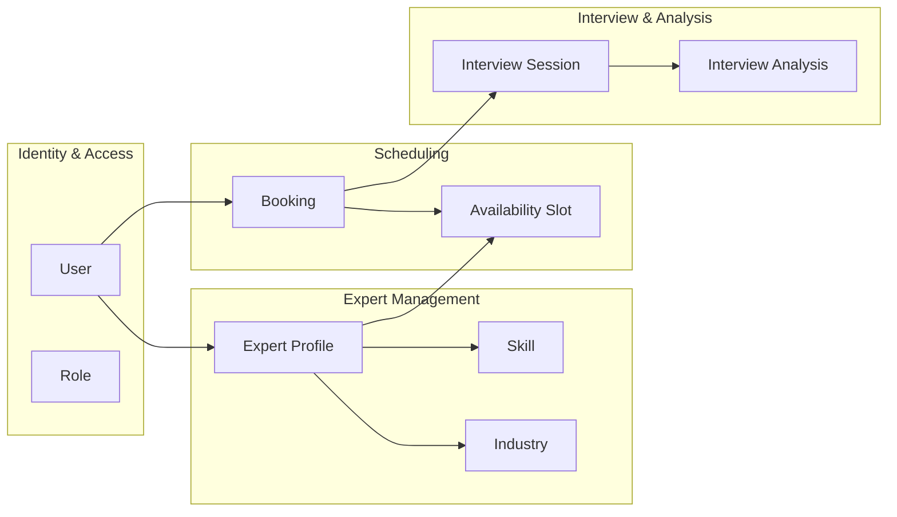
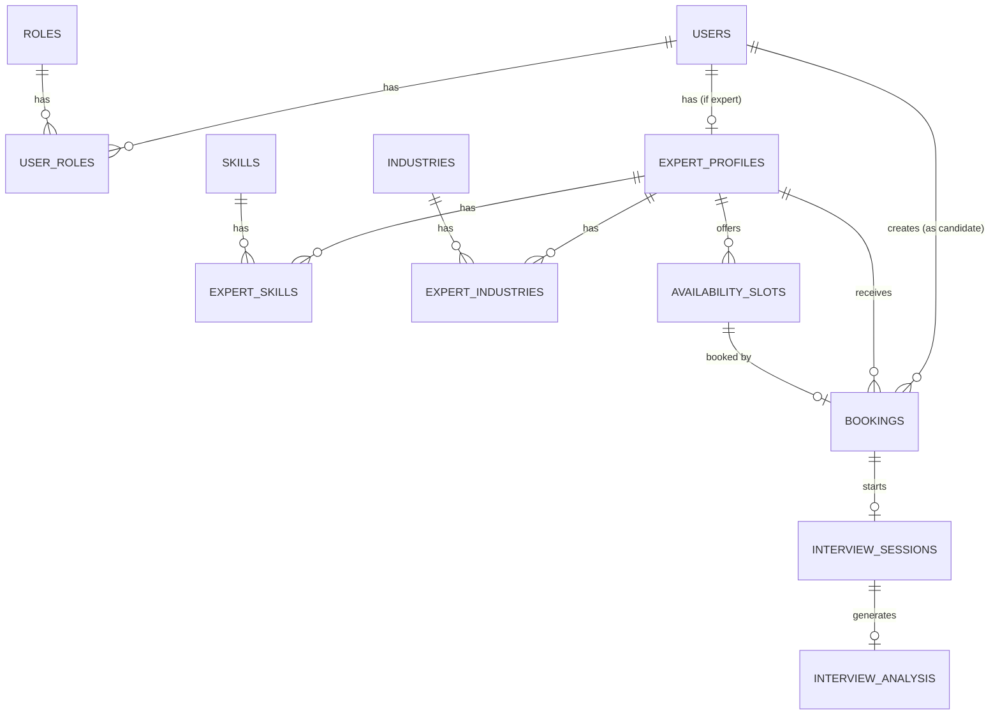
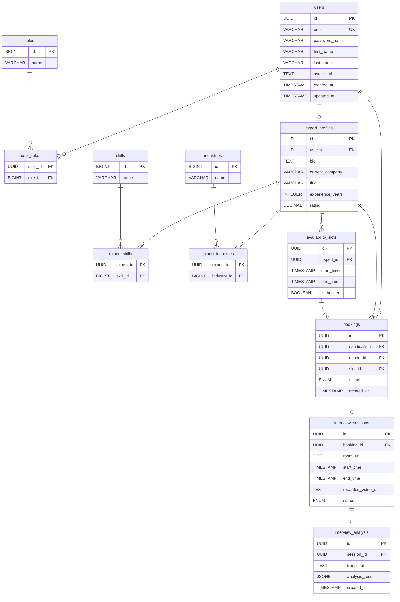

# Domain Model

## 3.1 Domain Overview

Internview'in domain modeli, bir adayın platforma kaydolmasından, uzman ile mülakat yapıp AI destekli performans raporu almasına kadarki tüm iş sürecini kapsayan entity'lerden oluşur.

### Ana Kavramlar (Bounded Contexts)



---

## 3.2 Core Entities

### User

Sistemdeki tüm kullanıcıları temsil eder. Bir kullanıcı hem aday hem uzman rolüne sahip olabilir.

| Alan | Tip | Açıklama |
|------|-----|----------|
| `id` | `UUID` | Benzersiz kullanıcı kimliği (Primary Key) |
| `email` | `VARCHAR(255)` | Kullanıcı e-posta adresi (Unique) |
| `password_hash` | `VARCHAR(255)` | BCrypt ile hashlenmiş parola |
| `first_name` | `VARCHAR(100)` | Ad |
| `last_name` | `VARCHAR(100)` | Soyad |
| `avatar_url` | `TEXT` | Profil fotoğrafı URL'i |
| `created_at` | `TIMESTAMP` | Oluşturulma tarihi |
| `updated_at` | `TIMESTAMP` | Son güncelleme tarihi |

### Role

Kullanıcıya atanabilen rolleri tanımlar. Many-to-Many ilişki ile bir kullanıcı birden fazla role sahip olabilir.

| Alan | Tip | Açıklama |
|------|-----|----------|
| `id` | `BIGINT` | Primary Key |
| `name` | `VARCHAR(50)` | Rol adı: `CANDIDATE`, `EXPERT`, `ADMIN` |

**Ara Tablo — `user_roles`:**

| Alan | Tip | Açıklama |
|------|-----|----------|
| `user_id` | `UUID` | FK → `users.id` |
| `role_id` | `BIGINT` | FK → `roles.id` |

### ExpertProfile

Uzman rolüne sahip kullanıcıların detaylı profil bilgilerini içerir.

| Alan | Tip | Açıklama |
|------|-----|----------|
| `id` | `UUID` | Primary Key |
| `user_id` | `UUID` | FK → `users.id` (One-to-One) |
| `bio` | `TEXT` | Uzman biyografisi |
| `current_company` | `VARCHAR(255)` | Çalıştığı şirket |
| `title` | `VARCHAR(255)` | Ünvanı (Sr. Software Engineer, CTO vb.) |
| `experience_years` | `INTEGER` | Toplam deneyim yılı |
| `rating` | `DECIMAL(3,2)` | Ortalama değerlendirme puanı (0.00 – 5.00) |

### Skill

Uzmanların sahip olduğu teknik yetenekleri temsil eder (Many-to-Many).

| Alan | Tip | Açıklama |
|------|-----|----------|
| `id` | `BIGINT` | Primary Key |
| `name` | `VARCHAR(100)` | Yetenek adı: Java, React, Flutter, System Design vb. |

**Ara Tablo — `expert_skills`:**

| Alan | Tip | Açıklama |
|------|-----|----------|
| `expert_id` | `UUID` | FK → `expert_profiles.id` |
| `skill_id` | `BIGINT` | FK → `skills.id` |

### Industry

Uzmanların uzmanlık sektörlerini tanımlar (Many-to-Many).

| Alan | Tip | Açıklama |
|------|-----|----------|
| `id` | `BIGINT` | Primary Key |
| `name` | `VARCHAR(100)` | Sektör adı: Fintech, E-Commerce, HealthTech vb. |

**Ara Tablo — `expert_industries`:**

| Alan | Tip | Açıklama |
|------|-----|----------|
| `expert_id` | `UUID` | FK → `expert_profiles.id` |
| `industry_id` | `BIGINT` | FK → `industries.id` |

### AvailabilitySlot

Uzmanların müsait oldukları zaman aralıklarını tanımlar.

| Alan | Tip | Açıklama |
|------|-----|----------|
| `id` | `UUID` | Primary Key |
| `expert_id` | `UUID` | FK → `expert_profiles.id` |
| `start_time` | `TIMESTAMP` | Slot başlangıç zamanı |
| `end_time` | `TIMESTAMP` | Slot bitiş zamanı |
| `is_booked` | `BOOLEAN` | Slot rezerve edildi mi? (Default: `false`) |

### Booking

Aday ile uzman arasındaki randevuyu temsil eder.

| Alan | Tip | Açıklama |
|------|-----|----------|
| `id` | `UUID` | Primary Key |
| `candidate_id` | `UUID` | FK → `users.id` (Randevu alan aday) |
| `expert_id` | `UUID` | FK → `expert_profiles.id` (Randevu verilen uzman) |
| `slot_id` | `UUID` | FK → `availability_slots.id` (Kapatılan slot) |
| `status` | `ENUM` | `PENDING` → `CONFIRMED` → `COMPLETED` / `CANCELLED` |
| `created_at` | `TIMESTAMP` | Randevu oluşturulma zamanı |

### InterviewSession

Bir randevunun gerçekleşen mülakat oturumunu temsil eder.

| Alan | Tip | Açıklama |
|------|-----|----------|
| `id` | `UUID` | Primary Key |
| `booking_id` | `UUID` | FK → `bookings.id` (One-to-One) |
| `room_url` | `TEXT` | WebRTC oda bağlantı adresi |
| `start_time` | `TIMESTAMP` | Oturum başlangıç zamanı |
| `end_time` | `TIMESTAMP` | Oturum bitiş zamanı |
| `recorded_video_url` | `TEXT` | S3'teki video kaydının URL'i |
| `status` | `ENUM` | `WAITING` → `IN_PROGRESS` → `COMPLETED` |

### InterviewAnalysis

AI tarafından üretilen mülakat analiz raporunu temsil eder.

| Alan | Tip | Açıklama |
|------|-----|----------|
| `id` | `UUID` | Primary Key |
| `session_id` | `UUID` | FK → `interview_sessions.id` (One-to-One) |
| `transcript` | `TEXT` | Konuşmanın tam metin dökümü |
| `analysis_result` | `JSONB` | Yapılandırılmış analiz metrikleri (aşağıya bakınız) |
| `created_at` | `TIMESTAMP` | Analiz tamamlanma zamanı |

**`analysis_result` JSONB Yapısı:**

```json
{
  "wpm": 142,
  "total_words": 2840,
  "duration_seconds": 1200,
  "pause_count": 23,
  "pause_ratio": 0.12,
  "filler_words": {
    "eee": 8,
    "hmm": 5,
    "yani": 12,
    "şey": 6
  },
  "filler_word_ratio": 0.011,
  "overall_score": 78.5
}
```

---

## 3.3 Relationships



### İlişki Özeti

| İlişki | Tip | Açıklama |
|--------|-----|----------|
| User ↔ Role | Many-to-Many | Bir kullanıcı birden fazla role sahip olabilir |
| User ↔ ExpertProfile | One-to-One | Sadece uzman rolündeki kullanıcılar |
| ExpertProfile ↔ Skill | Many-to-Many | Bir uzmanın birden fazla yeteneği olabilir |
| ExpertProfile ↔ Industry | Many-to-Many | Bir uzman birden fazla sektörde aktif olabilir |
| ExpertProfile ↔ AvailabilitySlot | One-to-Many | Uzman birden fazla müsaitlik aralığı tanımlayabilir |
| User ↔ Booking | One-to-Many | Aday birden fazla randevu oluşturabilir |
| ExpertProfile ↔ Booking | One-to-Many | Uzman birden fazla randevu alabilir |
| AvailabilitySlot ↔ Booking | One-to-One | Bir slot yalnızca bir randevuya atanabilir |
| Booking ↔ InterviewSession | One-to-One | Her randevu bir mülakat oturumuna karşılık gelir |
| InterviewSession ↔ InterviewAnalysis | One-to-One | Her oturum bir AI analiz raporu üretir |

---

## 3.4 ER Diagram

Aşağıdaki diyagram tüm entity'lerin veritabanı tablo temsillerini ve aralarındaki foreign key ilişkilerini göstermektedir.


