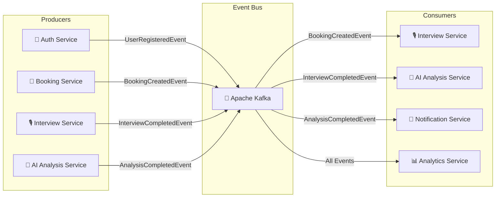
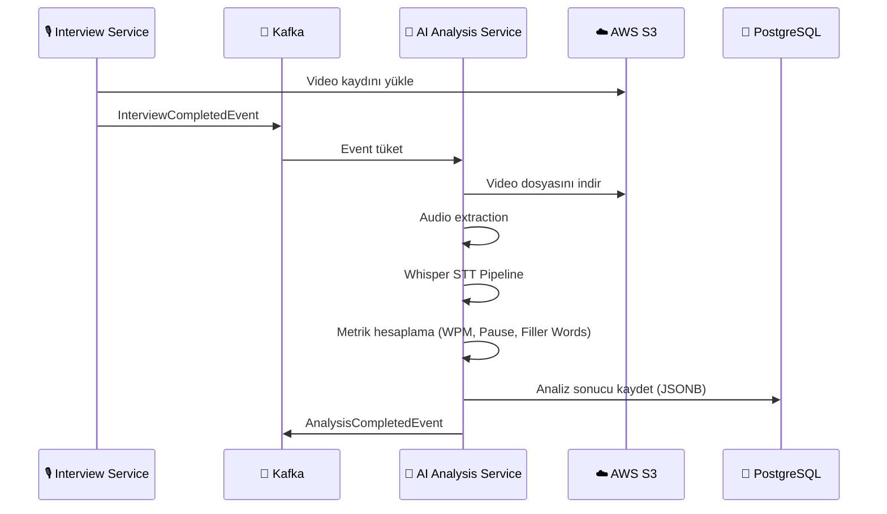

# Event Architecture

## 5.1 Event-Driven Architecture

Internview, yoğun iş yüklerini senkron API akışını bloke etmeden işleyebilmek için Apache Kafka tabanlı Event-Driven Architecture (EDA) kullanmaktadır.

### Neden Event-Driven?

| Motivasyon | Açıklama |
|-----------|----------|
| **Service Decoupling** | Servisler birbirini doğrudan çağırmak yerine event üzerinden haberleşir. Bir servisin arızası diğerlerini etkilemez. |
| **Asynchronous Processing** | Mülakat video analizi gibi ağır işlemler arka planda asenkron olarak yürütülür. |
| **Scalability** | Kafka partition'ları sayesinde consumer'lar yatay olarak ölçeklenebilir. |
| **Auditability** | Tüm eventler Kafka log'unda persistent olarak saklanır; geriye dönük izlenebilirlik sağlar. |
| **Extensibility** | Yeni servisler (Notification, Analytics) mevcut servisleri değiştirmeden event'leri dinleyebilir. |

### Mimari Genel Bakış



---

## 5.2 Event Topics

Kafka topic'leri servis alanlarına göre organize edilmiştir:

| Topic | Açıklama | Retention |
|-------|----------|-----------|
| `user-events` | Kullanıcı kaydı, profil güncellemeleri | 7 gün |
| `booking-events` | Randevu oluşturma, iptal, güncelleme | 30 gün |
| `interview-events` | Mülakat başlama, tamamlanma, iptal | 30 gün |
| `analysis-events` | AI analiz sonuçları | 90 gün |

### Topic Yapılandırması

```yaml
# Örnek Kafka Topic Konfigürasyonu
topics:
  booking-events:
    partitions: 6
    replication-factor: 3
    retention.ms: 2592000000    # 30 gün
    cleanup.policy: delete

  interview-events:
    partitions: 6
    replication-factor: 3
    retention.ms: 2592000000    # 30 gün

  analysis-events:
    partitions: 3
    replication-factor: 3
    retention.ms: 7776000000    # 90 gün
```

---

## 5.3 Event Producers

| Producer Service | Ürettiği Event'ler | Tetikleyen Aksiyon |
|------------------|-------------------|-------------------|
| **Auth Service** | `UserRegisteredEvent` | Yeni kullanıcı kaydı tamamlandığında |
| **Booking Service** | `BookingCreatedEvent`, `BookingCancelledEvent` | Randevu oluşturulduğunda veya iptal edildiğinde |
| **Interview Service** | `InterviewStartedEvent`, `InterviewCompletedEvent` | Mülakat başladığında ve tamamlandığında |
| **AI Analysis Service** | `AnalysisCompletedEvent` | Yapay zeka analizi bittiğinde |

---

## 5.4 Event Consumers

| Consumer Service | Dinlediği Event'ler | Yapılan İşlem |
|------------------|-------------------|--------------|
| **Interview Service** | `BookingCreatedEvent` | İleri tarihte mülakat oturumu için ön hazırlık ve hatırlatıcı oluşturma |
| **AI Analysis Service** | `InterviewCompletedEvent` | Video kaydını S3'ten alıp Whisper STT pipeline'ını başlatma |
| **Notification Service** | `AnalysisCompletedEvent`, `BookingCreatedEvent` | Adaya push bildirim ve e-posta gönderimi |
| **Analytics Service** | Tüm event'ler | Platform metrikleri ve kullanım istatistiklerinin hesaplanması |

---

## 5.5 Event Definitions

### BookingCreatedEvent

Randevu başarıyla oluşturulduğunda Booking Service tarafından fırlatılır.

**Topic:** `booking-events`
**Producer:** Booking Service
**Consumer(s):** Interview Service, Notification Service

```json
{
  "event_type": "BOOKING_CREATED",
  "event_id": "evt-550e8400-e29b-41d4-a716-446655440000",
  "timestamp": "2026-03-10T14:30:00Z",
  "payload": {
    "booking_id": "880e8400-e29b-41d4-a716-446655440003",
    "candidate_id": "550e8400-...",
    "expert_id": "660e8400-...",
    "slot_id": "770e8400-...",
    "scheduled_time": "2026-03-12T10:00:00Z",
    "status": "CONFIRMED"
  }
}
```

### InterviewCompletedEvent

Mülakat tamamlandığında ve video dosyası S3'e kaydedildiğinde Interview Service tarafından fırlatılır.

**Topic:** `interview-events`
**Producer:** Interview Service
**Consumer(s):** AI Analysis Service

```json
{
  "event_type": "INTERVIEW_COMPLETED",
  "event_id": "evt-660e8400-e29b-41d4-a716-446655440001",
  "timestamp": "2026-03-12T10:45:00Z",
  "payload": {
    "session_id": "990e8400-...",
    "booking_id": "880e8400-...",
    "candidate_id": "550e8400-...",
    "expert_id": "660e8400-...",
    "duration_seconds": 2700,
    "recorded_video_url": "s3://internview-recordings/sessions/990e8400.webm"
  }
}
```

**Akış:**



### AnalysisCompletedEvent

Yapay zeka analizi tamamlandığında AI Analysis Service tarafından fırlatılır.

**Topic:** `analysis-events`
**Producer:** AI Analysis Service
**Consumer(s):** Notification Service

```json
{
  "event_type": "ANALYSIS_COMPLETED",
  "event_id": "evt-770e8400-e29b-41d4-a716-446655440002",
  "timestamp": "2026-03-12T11:15:00Z",
  "payload": {
    "session_id": "990e8400-...",
    "candidate_id": "550e8400-...",
    "overall_score": 78.5,
    "analysis_summary": {
      "wpm": 142,
      "pause_ratio": 0.12,
      "filler_word_ratio": 0.011
    }
  }
}
```
