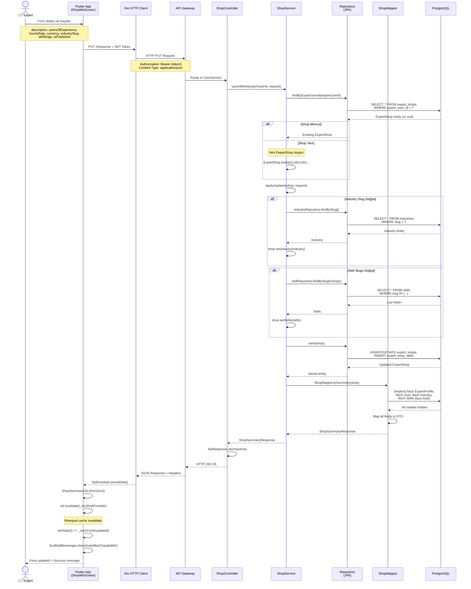

# Uzman Marketplace Shop Açma Akışı - Detaylı Dokumentasyon

## 📋 Özet

Bu dokümanda, Flutter Internview uygulamasında uzmanın marketplace'te shop (dükkan) açma ve yönetme sürecinin tüm katmanları detaylı şekilde açıklanmaktadır. Akış, frontend'den başlayarak backend servisi ve veri tabanına kadar uzanan bütün adımları kapsamaktadır.

---

## 1. Frontend Tarafı - Flutter Implementation

### 1.1 Navigation & Routing

**Dosya:** `mobile/internview/lib/app/router.dart`

```dart
GoRoute(path: '/shop-me', builder: (context, state) => const ShopMeScreen()),
```

Uzman, dashboard'dan veya expert self screen'den `/shop-me` route'ına navigate ederek shop yönetim ekranına erişir.

---

### 1.2 Shop Yönetim Screen (ShopMeScreen)

**Dosya:** `mobile/internview/lib/features/marketplace/presentation/shop_me_screen.dart`

#### 1.2.1 Screen Yapısı

```dart
class ShopMeScreen extends ConsumerStatefulWidget {
  const ShopMeScreen({super.key});

  @override
  ConsumerState<ShopMeScreen> createState() => _ShopMeScreenState();
}
```

**Riverpod Providers:**

```dart
final _myShopProvider = FutureProvider.autoDispose<ShopSummaryDto?>((ref) async {
  return ref.watch(marketplaceRemoteProvider).getMyShop();
});

final _mySlotsProvider = FutureProvider.autoDispose<List<SlotDto>>((ref) async {
  return ref.watch(bookingRemoteProvider).listMySlots();
});
```

- `_myShopProvider`: Mevcut kullanıcının shop verilerini yükler
- `_mySlotsProvider`: Uzmanın müsaitlik slot'larını yükler

#### 1.2.2 Form Alanları

Screen'de aşağıdaki input alanları bulunmaktadır:

| Alan | Tipi | Validation | Backend Column |
|------|------|------------|-----------------|
| `Açıklama` | TextEditingController | Maksimum 1000 karakter | `description` |
| `Tecrübe (yıl)` | TextEditingController (number) | Min: 0 | `yearsOfExperience` |
| `Saatlik ücret` | TextEditingController (number) | Min: 0 | `hourlyRate` |
| `Para Birimi` | DropdownButtonFormField | TRY, USD, EUR | `currency` |
| `Sektör` | DropdownButtonFormField | Industry slug | `industrySlug` |
| `Yetenekler` | FilterChip Set | Multiple select | `skillSlugs` |
| `Pazarda yayınla` | SwitchListTile | Boolean | `isPublished` |

#### 1.2.3 State Management

State class'ında form verilerini tutmak için kullanılan alanlar:

```dart
class _ShopMeScreenState extends ConsumerState<ShopMeScreen> {
  final _desc = TextEditingController();
  final _years = TextEditingController();
  final _rate = TextEditingController();
  String _currency = 'TRY';
  String? _industrySlug;
  final Set<String> _skillSlugs = {};
  bool _published = false;
  bool _saving = false;
  bool _seeded = false;
```

#### 1.2.4 Veri Yükleme & Seeding

Shop verisi ilk kez yüklendiğinde form'a doldurulmaktadır:

```dart
void _syncFrom(ShopSummaryDto? s) {
  if (s == null) return;
  _desc.text = s.description ?? '';
  _years.text = s.yearsOfExperience.toString();
  _rate.text = s.hourlyRate?.toString() ?? '';
  _currency = s.currency ?? _currency;
  _industrySlug = s.industry?.slug;
  _skillSlugs
    ..clear()
    ..addAll(s.skills.map((e) => e.slug));
  _published = s.isPublished;
}
```

Kullanıcı screen açtığında widget tree'ye post-frame callback eklenir ve `_syncFrom()` çağrılır.

#### 1.2.5 Save Button & Request

```dart
AnimatedActionButton(
  onTap: _saving
      ? null
      : () async {
          setState(() => _saving = true);
          try {
            final updated = await ref.read(marketplaceRemoteProvider).upsertMyShop(
                  description: _desc.text.trim(),
                  yearsOfExperience: int.tryParse(_years.text) ?? 0,
                  hourlyRate: double.tryParse(_rate.text) ?? 0,
                  currency: _currency,
                  industrySlug: _industrySlug,
                  skillSlugs: _skillSlugs,
                  isPublished: _published,
                );
            ref.invalidate(_myShopProvider);
            if (context.mounted) {
              ScaffoldMessenger.of(context).showSnackBar(
                const SnackBar(content: Text('Kaydedildi'))
              );
              setState(() => _syncFrom(updated));
            }
          } on ApiException catch (e) {
            if (context.mounted) {
              ScaffoldMessenger.of(context).showSnackBar(
                SnackBar(content: Text(e.message))
              );
            }
          } finally {
            if (mounted) setState(() => _saving = false);
          }
        },
  width: double.infinity,
  height: 48,
  color: const Color(0xFF00E5FF),
  // ... styling
  child: Center(
    child: _saving
        ? const SkeletonContainer(width: 120, height: 14, borderRadius: 8)
        : const Text('Kaydet', style: TextStyle(fontWeight: FontWeight.w900)),
  ),
)
```

---

### 1.3 Remote Data Source - Dio Client

**Dosya:** `mobile/internview/lib/features/marketplace/data/marketplace_remote_data_source.dart`

#### 1.3.1 Provider Tanımı

```dart
final marketplaceRemoteProvider = Provider<MarketplaceRemoteDataSource>(
  (ref) => MarketplaceRemoteDataSource(ref.watch(dioProvider)),
);

class MarketplaceRemoteDataSource {
  MarketplaceRemoteDataSource(this._dio);
  final Dio _dio;
```

#### 1.3.2 upsertMyShop Metodu

**HTTP Methodu:** `PUT`  
**Endpoint:** `/shops/me`  
**Authentication:** JWT Bearer Token (otomatik Dio interceptor'dan)

```dart
Future<ShopSummaryDto> upsertMyShop({
  required String description,
  required int yearsOfExperience,
  required double hourlyRate,
  required String currency,
  String? industrySlug,
  required Set<String> skillSlugs,
  required bool isPublished,
}) async {
  try {
    final r = await _dio.put<Map<String, dynamic>>(
      '/shops/me',
      data: {
        'description': description,
        'yearsOfExperience': yearsOfExperience,
        'hourlyRate': hourlyRate,
        'currency': currency,
        'industrySlug': industrySlug ?? '',
        'skillSlugs': skillSlugs.toList(),
        'isPublished': isPublished,
      },
    );
    return ApiEnvelope.parseData(
      r.data,
      (j) => ShopSummaryDto.fromJson(Map<String, dynamic>.from(j! as Map)),
    );
  } on DioException catch (e) {
    throw _fromDio(e);
  }
}
```

**Request Body Örneği:**
```json
{
  "description": "Senior Java Developer with 8 years experience",
  "yearsOfExperience": 8,
  "hourlyRate": 150.0,
  "currency": "USD",
  "industrySlug": "fintech",
  "skillSlugs": ["java", "spring-boot", "microservices"],
  "isPublished": true
}
```

#### 1.3.3 Error Handling

```dart
ApiException _fromDio(DioException e) {
  final code = e.response?.statusCode;
  final data = e.response?.data;
  if (data is Map) {
    final ae = ApiEnvelope.tryParseError(data);
    // ... error parsing
  }
  // ... generic error handling
}
```

#### 1.3.4 Diğer İlgili Metodlar

```dart
// Mevcut kullanıcının shop'unu getir
Future<ShopSummaryDto?> getMyShop() async {
  try {
    final r = await _dio.get<Map<String, dynamic>>('/shops/me');
    return ApiEnvelope.parseData(
      r.data,
      (j) => j == null ? null : ShopSummaryDto.fromJson(Map<String, dynamic>.from(j as Map)),
    );
  } on DioException catch (e) {
    throw _fromDio(e);
  }
}

// Tüm shop'ları listele (filtreleme ve pagination)
Future<PageResponse<ShopSummaryDto>> listShops({
  int page = 0,
  int size = 20,
  String? industrySlug,
  Set<String>? skillSlugs,
  double? minRating,
  double? minPrice,
  double? maxPrice,
  bool? isAvailable,
  bool publishedOnly = true,
}) async {
  // ... implementation
}

// Belirli bir shop'ı ID ile getir
Future<ShopSummaryDto> getShop(String id) async {
  // ... implementation
}

// Uzman istatistiklerini getir
Future<ExpertStatsDto> getExpertStats(String expertUserId) async {
  // ... implementation
}

// Uzman reviews'larını getir
Future<PageResponse<ExpertReviewDto>> getExpertReviews({
  required String expertUserId,
  int page = 0,
  int size = 20,
}) async {
  // ... implementation
}
```

---

### 1.4 Data Models - Deserialization

**Dosya:** `mobile/internview/lib/core/models/shop_models.dart`

#### 1.4.1 ShopSummaryDto

```dart
class ShopSummaryDto {
  ShopSummaryDto({
    required this.id,
    required this.expertUserId,
    required this.expertFirstName,
    required this.expertLastName,
    required this.expertAvatarUrl,
    required this.industry,
    required this.skills,
    required this.description,
    required this.yearsOfExperience,
    required this.hourlyRate,
    required this.currency,
    required this.isPublished,
    required this.averageRating,
    required this.isAvailable,
  });

  final String id;
  final String expertUserId;
  final String expertFirstName;
  final String expertLastName;
  final String? expertAvatarUrl;
  final IndustryDto? industry;
  final List<SkillDto> skills;
  final String? description;
  final int yearsOfExperience;
  final double? hourlyRate;
  final String? currency;
  final bool isPublished;
  final double? averageRating;
  final bool? isAvailable;

  String get expertFullName => '$expertFirstName $expertLastName'.trim();

  factory ShopSummaryDto.fromJson(Map<String, dynamic> j) {
    return ShopSummaryDto(
      id: j['id'].toString(),
      expertUserId: j['expertUserId'].toString(),
      expertFirstName: j['expertFirstName'] as String? ?? '',
      expertLastName: j['expertLastName'] as String? ?? '',
      expertAvatarUrl: normalizeAvatarUrl(j['expertAvatarUrl'] as String?),
      industry: j['industry'] != null 
        ? IndustryDto.fromJson(Map<String, dynamic>.from(j['industry'] as Map)) 
        : null,
      skills: (j['skills'] as List<dynamic>?)
              ?.map((e) => SkillDto.fromJson(Map<String, dynamic>.from(e as Map)))
              .toList() ?? 
          const [],
      description: j['description'] as String?,
      yearsOfExperience: (j['yearsOfExperience'] as num?)?.toInt() ?? 0,
      hourlyRate: (j['hourlyRate'] as num?)?.toDouble(),
      currency: j['currency'] as String?,
      isPublished: j['isPublished'] as bool? ?? false,
      averageRating: (j['averageRating'] as num?)?.toDouble(),
      isAvailable: j['isAvailable'] as bool?,
    );
  }
}
```

**JSON Response Örneği:**
```json
{
  "id": "550e8400-e29b-41d4-a716-446655440000",
  "expertUserId": "550e8400-e29b-41d4-a716-446655440001",
  "expertFirstName": "Mehmet",
  "expertLastName": "Kaya",
  "expertAvatarUrl": "https://s3.amazonaws.com/avatars/mehmet.jpg",
  "industry": {
    "id": "660e8400-e29b-41d4-a716-446655440002",
    "name": "Fintech",
    "slug": "fintech"
  },
  "skills": [
    {
      "id": "770e8400-e29b-41d4-a716-446655440003",
      "name": "Java",
      "slug": "java"
    },
    {
      "id": "770e8400-e29b-41d4-a716-446655440004",
      "name": "Spring Boot",
      "slug": "spring-boot"
    }
  ],
  "description": "Senior Backend Engineer with 8 years experience",
  "yearsOfExperience": 8,
  "hourlyRate": 150.00,
  "currency": "USD",
  "isPublished": true,
  "averageRating": 4.85,
  "isAvailable": true
}
```

#### 1.4.2 ExpertStatsDto

```dart
class ExpertStatsDto {
  ExpertStatsDto({
    required this.expertUserId,
    required this.averageRating,
    required this.totalRated,
    required this.completedCount,
    required this.cancelledCount,
  });

  final String expertUserId;
  final double? averageRating;
  final int totalRated;
  final int completedCount;
  final int cancelledCount;

  factory ExpertStatsDto.fromJson(Map<String, dynamic> j) {
    return ExpertStatsDto(
      expertUserId: j['expertUserId'].toString(),
      averageRating: (j['averageRating'] as num?)?.toDouble(),
      totalRated: (j['totalRated'] as num?)?.toInt() ?? 0,
      completedCount: (j['completedCount'] as num?)?.toInt() ?? 0,
      cancelledCount: (j['cancelledCount'] as num?)?.toInt() ?? 0,
    );
  }
}
```

#### 1.4.3 Nested DTOs

```dart
class IndustryDto {
  final String id;
  final String name;
  final String slug;
  
  factory IndustryDto.fromJson(Map<String, dynamic> j) {
    return IndustryDto(
      id: j['id'].toString(),
      name: j['name'] as String,
      slug: j['slug'] as String,
    );
  }
}

class SkillDto {
  final String id;
  final String name;
  final String slug;
  
  factory SkillDto.fromJson(Map<String, dynamic> j) {
    return SkillDto(
      id: j['id'].toString(),
      name: j['name'] as String,
      slug: j['slug'] as String,
    );
  }
}
```

---

## 2. API Gateway & Routing

**Dosya:** `backend/gateway/src/main/java/.../GatewayConfig.java`

API Gateway, tüm request'leri backend servislere route etmektedir.

```
Client Request: PUT /shops/me
  ↓
API Gateway
  ↓
User Service: PUT /shops/me
```

**Gateway Routing:**
- `/shops/**` → User Service
- Authentication: JWT Token validation (BasicAuth filter)
- Rate Limiting: Redis RateLimiter

---

## 3. Backend Implementation - User Service

### 3.1 REST Controller

**Dosya:** `backend/user-service/src/main/java/io/internview/user_service/web/ShopController.java`

#### 3.1.1 PUT /shops/me Endpoint

```java
@PutMapping("/me")
@PreAuthorize("hasRole('EXPERT')")
public ApiResponse<ShopSummaryResponse> upsertMine(
  @AuthenticationPrincipal Jwt jwt,
  @Valid @RequestBody UpsertShopRequest request
) {
  UUID expertUserId = UUID.fromString(jwt.getSubject());
  return ApiResponse.ok(this.shopService.upsertMine(expertUserId, request));
}
```

**Açıklama:**
- `@PreAuthorize("hasRole('EXPERT')")` - Sadece EXPERT rolü olan kullanıcılar bu endpoint'i çağırabilir
- `@AuthenticationPrincipal Jwt jwt` - JWT token'dan kullanıcı ID'si çıkarılır
- `@Valid` - Request body Validation anotasyonları kontrol edilir
- Response wrapper `ApiResponse<ShopSummaryResponse>` formatında döner

#### 3.1.2 Diğer Endpoints

```java
@GetMapping
@PreAuthorize("isAuthenticated()")
public ApiResponse<PageResponse<ShopSummaryResponse>> list(
  @RequestParam(required = false) String industry,
  @RequestParam(required = false, name = "skill") Set<String> skillSlugs,
  @RequestParam(required = false, name = "min_rating") BigDecimal minRating,
  @RequestParam(required = false, name = "min_price") BigDecimal minPrice,
  @RequestParam(required = false, name = "max_price") BigDecimal maxPrice,
  @RequestParam(required = false, name = "is_available") Boolean isAvailable,
  @RequestParam(required = false, name = "published_only") Boolean publishedOnly,
  @RequestParam(defaultValue = "0") int page,
  @RequestParam(defaultValue = "20") int size
) {
  Page<ShopSummaryResponse> result = shopService.list(
    industry, skillSlugs, minRating, minPrice, maxPrice, 
    isAvailable, publishedOnly, page, size
  );
  return ApiResponse.ok(PageResponse.from(result));
}

@GetMapping("/{id}")
@PreAuthorize("isAuthenticated()")
public ApiResponse<ShopSummaryResponse> getById(@PathVariable UUID id) {
  return ApiResponse.ok(this.shopService.getById(id));
}

@GetMapping("/me")
@PreAuthorize("hasRole('EXPERT')")
public ApiResponse<ShopSummaryResponse> getMine(@AuthenticationPrincipal Jwt jwt) {
  UUID expertUserId = UUID.fromString(jwt.getSubject());
  return ApiResponse.ok(this.shopService.getMine(expertUserId));
}
```

---

### 3.2 Request DTO

**Dosya:** `backend/user-service/src/main/java/io/internview/user_service/web/dto/UpsertShopRequest.java`

```java
@Data
public class UpsertShopRequest {
  String description;
  Integer yearsOfExperience;
  BigDecimal hourlyRate;
  String currency;
  String industrySlug;
  Set<String> skillSlugs;
  @NotNull
  Boolean isPublished;
}
```

**Validation Rules:**
- `isPublished` - @NotNull (zorunlu)
- Diğer alanlar - opsiyonel (null değer alabilir)
- `skillSlugs` - Set<String>, birden fazla yetenek seçilebilir

**Örnek Request JSON:**
```json
{
  "description": "Senior Java Developer with 8 years experience",
  "yearsOfExperience": 8,
  "hourlyRate": 150.00,
  "currency": "USD",
  "industrySlug": "fintech",
  "skillSlugs": ["java", "spring-boot", "microservices"],
  "isPublished": true
}
```

---

### 3.3 Business Logic - ShopService

**Dosya:** `backend/user-service/src/main/java/io/internview/user_service/service/ShopService.java`

#### 3.3.1 upsertMine Metodu

```java
@Transactional
public ShopSummaryResponse upsertMine(UUID expertUserId, UpsertShopRequest request) {
  // 1. Kullanıcıyı veritabanından getir
  User user = userRepository.findById(expertUserId)
    .orElseThrow(() -> new UserNotFoundException("Kullanıcı bulunamadı: " + expertUserId));
  
  // 2. EXPERT rolü kontrolü
  if (user.getRole() != UserRole.EXPERT) {
    throw new InvalidRoleException("Sadece EXPERT rolündeki kullanıcılar dükkan açabilir");
  }

  // 3. Mevcut shop'ı getir veya yeni oluştur
  ExpertShop shop = shopRepository.findByExpertUserId(expertUserId).orElse(null);
  if (shop == null) {
    shop = ExpertShop.builder()
      .id(UUID.randomUUID())
      .expertUserId(expertUserId)
      .yearsOfExperience(0)
      .currency("USD")
      .isPublished(false)
      .skills(new HashSet<>())
      .build();
  }

  // 4. Shop'u güncellemeler ile update et
  applyUpdates(shop, request);
  
  // 5. Veritabanına kaydet
  return ShopMapper.toSummary(shopRepository.save(shop));
}
```

#### 3.3.2 applyUpdates Metodu (Private)

```java
private void applyUpdates(ExpertShop shop, UpsertShopRequest request) {
  if (request.getDescription() != null) {
    shop.setDescription(request.getDescription());
  }
  if (request.getYearsOfExperience() != null) {
    shop.setYearsOfExperience(Math.max(request.getYearsOfExperience(), 0));
  }
  if (request.getHourlyRate() != null) {
    shop.setHourlyRate(request.getHourlyRate());
  }
  if (request.getCurrency() != null && !request.getCurrency().isBlank()) {
    shop.setCurrency(request.getCurrency().trim());
  }
  if (request.getIsPublished() != null) {
    shop.setIsPublished(request.getIsPublished());
  }
  // Industry güncelleme
  if (request.getIndustrySlug() != null) {
    if (request.getIndustrySlug().isBlank()) {
      shop.setIndustry(null);
    } else {
      Industry industry = industryRepository.findBySlug(request.getIndustrySlug())
        .orElseThrow(() -> new IllegalArgumentException(
          "Sektör slug bulunamadı: " + request.getIndustrySlug()
        ));
      shop.setIndustry(industry);
    }
  }
  // Skill'ler güncelleme
  if (request.getSkillSlugs() != null) {
    Set<String> normalized = new HashSet<>();
    for (String slug : request.getSkillSlugs()) {
      if (slug != null && !slug.isBlank()) normalized.add(slug.trim());
    }
    if (normalized.isEmpty()) {
      shop.getSkills().clear();
    } else {
      List<Skill> found = skillRepository.findBySlugIn(normalized);
      if (found.size() != normalized.size()) {
        Set<String> foundSlugs = new HashSet<>();
        for (Skill s : found) foundSlugs.add(s.getSlug());
        normalized.removeAll(foundSlugs);
        throw new IllegalArgumentException(
          "Yetenek slug'ları bulunamadı: " + normalized
        );
      }
      shop.setSkills(new HashSet<>(found));
    }
  }
}
```

#### 3.3.3 Diğer Servis Metodları

```java
@Transactional(readOnly = true)
public ShopSummaryResponse getMine(UUID expertUserId) {
  ExpertShop shop = shopRepository.findByExpertUserId(expertUserId).orElse(null);
  if (shop == null) return null;
  return ShopMapper.toSummary(shop);
}

@Transactional(readOnly = true)
public ShopSummaryResponse getById(UUID id) {
  ExpertShop shop = shopRepository.findById(id)
    .orElseThrow(() -> new IllegalArgumentException("Dükkan bulunamadı: " + id));
  return ShopMapper.toSummary(shop);
}

@Transactional(readOnly = true)
public Page<ShopSummaryResponse> list(
  String industrySlug, Set<String> skillSlugs, BigDecimal minRating,
  BigDecimal minPrice, BigDecimal maxPrice, Boolean isAvailable,
  Boolean publishedOnly, int page, int size
) {
  List<Specification<ExpertShop>> specs = Stream.<Specification<ExpertShop>>of(
    ExpertShopSpecifications.publishedOnly(publishedOnly),
    ExpertShopSpecifications.industrySlug(industrySlug),
    ExpertShopSpecifications.hasAnySkillSlug(skillSlugs),
    ExpertShopSpecifications.minRating(minRating),
    ExpertShopSpecifications.minPrice(minPrice),
    ExpertShopSpecifications.maxPrice(maxPrice),
    ExpertShopSpecifications.isAvailable(isAvailable)
  ).filter(Objects::nonNull).toList();

  Specification<ExpertShop> spec = specs.stream().reduce(Specification::and).orElse(null);
  Pageable pageable = PageRequest.of(
    Math.max(page, 0), 
    Math.min(Math.max(size, 1), MAX_PAGE_SIZE)
  );
  return shopRepository.findAll(spec, pageable).map(ShopMapper::toSummary);
}
```

---

### 3.4 Domain Entity

**Dosya:** `backend/user-service/src/main/java/io/internview/user_service/domain/ExpertShop.java`

```java
@Entity
@Table(name = "expert_shops")
@Getter
@Setter
@NoArgsConstructor
@AllArgsConstructor
@Builder
public class ExpertShop {

  @Id
  @Column(nullable = false, updatable = false)
  private UUID id;

  @Column(name = "expert_user_id", nullable = false, unique = true, updatable = false)
  private UUID expertUserId;

  @ManyToOne(fetch = FetchType.LAZY)
  @JoinColumn(name = "industry_id")
  private Industry industry;

  @Column(columnDefinition = "TEXT")
  private String description;

  @Column(name = "years_of_experience", nullable = false)
  private Integer yearsOfExperience;

  @Column(name = "hourly_rate", precision = 10, scale = 2)
  private BigDecimal hourlyRate;

  @Column(nullable = false, length = 3)
  private String currency;

  @Column(name = "is_published", nullable = false)
  private Boolean isPublished;

  @ManyToMany(fetch = FetchType.LAZY)
  @JoinTable(
    name = "expert_shop_skills",
    joinColumns = @JoinColumn(name = "expert_shop_id"),
    inverseJoinColumns = @JoinColumn(name = "skill_id")
  )
  @Builder.Default
  private Set<Skill> skills = new HashSet<>();

  // Filtreleme ve mapping için ExpertProfile'a join
  @OneToOne(fetch = FetchType.LAZY)
  @JoinColumn(name = "expert_user_id", referencedColumnName = "user_id", 
              insertable = false, updatable = false)
  private ExpertProfile expertProfile;

  @CreationTimestamp
  @Column(name = "created_at", nullable = false, updatable = false)
  private Instant createdAt;

  @UpdateTimestamp
  @Column(name = "updated_at", nullable = false)
  private Instant updatedAt;
}
```

**Database Tabloları:**

| Tablo | Açıklama |
|-------|----------|
| `expert_shops` | Shop'ın ana tablosu |
| `expert_shop_skills` | Shop - Skill Many-to-Many ilişkisi |
| `industries` | Sektörler lookup tablosu |
| `skills` | Yetenekler lookup tablosu |

---

### 3.5 DTO Mapper

**Dosya:** `backend/user-service/src/main/java/io/internview/user_service/web/mapper/ShopMapper.java`

```java
public final class ShopMapper {

  private ShopMapper() {}

  public static ShopSummaryResponse toSummary(ExpertShop shop) {
    ExpertProfile p = shop.getExpertProfile();
    User u = p != null ? p.getUser() : null;

    return ShopSummaryResponse.builder()
      .id(shop.getId())
      .expertUserId(shop.getExpertUserId())
      .expertFirstName(u != null ? u.getFirstName() : "")
      .expertLastName(u != null ? u.getLastName() : "")
      .expertAvatarUrl(u != null ? u.getAvatarUrl() : null)
      .industry(shop.getIndustry() != null
        ? IndustryResponse.builder()
          .id(shop.getIndustry().getId())
          .name(shop.getIndustry().getName())
          .slug(shop.getIndustry().getSlug())
          .build()
        : null)
      .skills(mapSkills(shop))
      .description(shop.getDescription())
      .yearsOfExperience(shop.getYearsOfExperience())
      .hourlyRate(shop.getHourlyRate())
      .currency(shop.getCurrency())
      .isPublished(shop.getIsPublished())
      .averageRating(p != null ? p.getAverageRating() : null)
      .isAvailable(p != null ? p.getIsAvailable() : null)
      .createdAt(shop.getCreatedAt())
      .updatedAt(shop.getUpdatedAt())
      .build();
  }

  private static Set<SkillResponse> mapSkills(ExpertShop shop) {
    if (shop.getSkills() == null) return Set.of();
    return shop.getSkills().stream()
      .map(s -> SkillResponse.builder()
        .id(s.getId())
        .name(s.getName())
        .slug(s.getSlug())
        .build())
      .collect(Collectors.toSet());
  }
}
```

**Mapping Süreci:**
1. ExpertShop entity'si alınır
2. Related ExpertProfile ve User entity'leri fetch edilir
3. Tüm alanlar DTO'ya map edilir
4. Nested objects (Industry, Skill'ler) de map edilir

---

### 3.6 Response DTO

**Dosya:** `backend/user-service/src/main/java/io/internview/user_service/web/dto/ShopSummaryResponse.java`

```java
@Value
@Builder
public class ShopSummaryResponse {
  UUID id;
  UUID expertUserId;
  String expertFirstName;
  String expertLastName;
  String expertAvatarUrl;

  IndustryResponse industry;
  Set<SkillResponse> skills;

  String description;
  Integer yearsOfExperience;
  BigDecimal hourlyRate;
  String currency;
  Boolean isPublished;

  // ExpertProfile'dan join'lenen alanlar
  BigDecimal averageRating;
  Boolean isAvailable;

  Instant createdAt;
  Instant updatedAt;
}

@Value
@Builder
public class IndustryResponse {
  UUID id;
  String name;
  String slug;
}

@Value
@Builder
public class SkillResponse {
  UUID id;
  String name;
  String slug;
}
```

**JSON Response Örneği:**
```json
{
  "success": true,
  "data": {
    "id": "550e8400-e29b-41d4-a716-446655440000",
    "expertUserId": "550e8400-e29b-41d4-a716-446655440001",
    "expertFirstName": "Mehmet",
    "expertLastName": "Kaya",
    "expertAvatarUrl": "https://s3.amazonaws.com/avatars/mehmet.jpg",
    "industry": {
      "id": "660e8400-e29b-41d4-a716-446655440002",
      "name": "Fintech",
      "slug": "fintech"
    },
    "skills": [
      {
        "id": "770e8400-e29b-41d4-a716-446655440003",
        "name": "Java",
        "slug": "java"
      },
      {
        "id": "770e8400-e29b-41d4-a716-446655440004",
        "name": "Spring Boot",
        "slug": "spring-boot"
      }
    ],
    "description": "Senior Java Developer with 8 years experience",
    "yearsOfExperience": 8,
    "hourlyRate": 150.00,
    "currency": "USD",
    "isPublished": true,
    "averageRating": 4.85,
    "isAvailable": true,
    "createdAt": "2026-04-01T10:00:00Z",
    "updatedAt": "2026-04-20T12:00:00Z"
  },
  "timestamp": "2026-04-20T12:00:00Z"
}
```

---

## 4. Database Schema

### 4.1 expert_shops Tablosu

```sql
CREATE TABLE expert_shops (
  id UUID PRIMARY KEY NOT NULL,
  expert_user_id UUID NOT NULL UNIQUE NOT NULL,
  industry_id UUID REFERENCES industries(id),
  description TEXT,
  years_of_experience INTEGER NOT NULL,
  hourly_rate DECIMAL(10, 2),
  currency VARCHAR(3) NOT NULL,
  is_published BOOLEAN NOT NULL,
  created_at TIMESTAMP NOT NULL,
  updated_at TIMESTAMP NOT NULL,
  FOREIGN KEY (expert_user_id) REFERENCES users(id) ON DELETE CASCADE
);
```

### 4.2 expert_shop_skills Tablosu (Junction)

```sql
CREATE TABLE expert_shop_skills (
  expert_shop_id UUID NOT NULL,
  skill_id UUID NOT NULL,
  PRIMARY KEY (expert_shop_id, skill_id),
  FOREIGN KEY (expert_shop_id) REFERENCES expert_shops(id) ON DELETE CASCADE,
  FOREIGN KEY (skill_id) REFERENCES skills(id) ON DELETE RESTRICT
);
```

### 4.3 İlgili Tablolar

```sql
-- Industries
CREATE TABLE industries (
  id UUID PRIMARY KEY,
  name VARCHAR(100) NOT NULL UNIQUE,
  slug VARCHAR(120) NOT NULL UNIQUE,
  created_at TIMESTAMP NOT NULL
);

-- Skills
CREATE TABLE skills (
  id UUID PRIMARY KEY,
  name VARCHAR(100) NOT NULL UNIQUE,
  slug VARCHAR(120) NOT NULL UNIQUE,
  created_at TIMESTAMP NOT NULL
);

-- Expert Profiles (user-service)
CREATE TABLE expert_profiles (
  id UUID PRIMARY KEY,
  user_id UUID NOT NULL UNIQUE,
  industry_id UUID REFERENCES industries(id),
  headline VARCHAR(160),
  bio TEXT,
  company VARCHAR(160),
  years_of_experience INTEGER,
  hourly_rate DECIMAL(10, 2),
  currency VARCHAR(3),
  average_rating DECIMAL(3, 2),
  total_sessions INTEGER,
  is_verified BOOLEAN,
  is_available BOOLEAN,
  created_at TIMESTAMP NOT NULL,
  updated_at TIMESTAMP NOT NULL,
  FOREIGN KEY (user_id) REFERENCES users(id) ON DELETE CASCADE
);
```

---

## 5. Complete Flow Diagram



---

## 6. Error Handling & Scenarios

### 6.1 Success Scenario (200 OK)

```json
{
  "success": true,
  "data": { /* ShopSummaryResponse */ },
  "timestamp": "2026-04-20T12:00:00Z"
}
```

### 6.2 Error Scenarios

#### 6.2.1 Unauthorized (401)

**Sebep:** JWT token geçersiz, süresi dolmuş veya eksik

```json
{
  "success": false,
  "error": {
    "code": "UNAUTHORIZED",
    "message": "Yetkisiz erişim"
  },
  "timestamp": "2026-04-20T12:00:00Z"
}
```

#### 6.2.2 Forbidden (403)

**Sebep:** Kullanıcının rolü EXPERT değil

```json
{
  "success": false,
  "error": {
    "code": "INVALID_ROLE",
    "message": "Sadece EXPERT rolündeki kullanıcılar dükkan açabilir"
  },
  "timestamp": "2026-04-20T12:00:00Z"
}
```

#### 6.2.3 Bad Request (400)

**Sebep:** Validation hatası (ör. isPublished null, industry slug yanlış)

```json
{
  "success": false,
  "error": {
    "code": "INVALID_INPUT",
    "message": "Sektör slug bulunamadı: invalid-slug"
  },
  "timestamp": "2026-04-20T12:00:00Z"
}
```

#### 6.2.4 Not Found (404)

**Sebep:** Kullanıcı bulunamadı

```json
{
  "success": false,
  "error": {
    "code": "USER_NOT_FOUND",
    "message": "Kullanıcı bulunamadı: {userId}"
  },
  "timestamp": "2026-04-20T12:00:00Z"
}
```

### 6.3 Flutter Error Handling

```dart
try {
  final updated = await ref.read(marketplaceRemoteProvider).upsertMyShop(
    description: _desc.text.trim(),
    yearsOfExperience: int.tryParse(_years.text) ?? 0,
    hourlyRate: double.tryParse(_rate.text) ?? 0,
    currency: _currency,
    industrySlug: _industrySlug,
    skillSlugs: _skillSlugs,
    isPublished: _published,
  );
  ref.invalidate(_myShopProvider);
  ScaffoldMessenger.of(context).showSnackBar(
    const SnackBar(content: Text('Kaydedildi'))
  );
  setState(() => _syncFrom(updated));
} on ApiException catch (e) {
  ScaffoldMessenger.of(context).showSnackBar(
    SnackBar(content: Text(e.message))
  );
} finally {
  if (mounted) setState(() => _saving = false);
}
```

---

## 7. State Management & Caching

### 7.1 Riverpod Providers

```dart
// 1. API data source provider
final marketplaceRemoteProvider = Provider<MarketplaceRemoteDataSource>(
  (ref) => MarketplaceRemoteDataSource(ref.watch(dioProvider)),
);

// 2. Mevcut user'ın shop'unu cache eden provider
final _myShopProvider = FutureProvider.autoDispose<ShopSummaryDto?>((ref) async {
  return ref.watch(marketplaceRemoteProvider).getMyShop();
});

// 3. Invalidation sonrası re-fetch
ref.invalidate(_myShopProvider);
```

### 7.2 Local State

```dart
// Form state
final _desc = TextEditingController();
final _years = TextEditingController();
final _rate = TextEditingController();
String _currency = 'TRY';
String? _industrySlug;
final Set<String> _skillSlugs = {};
bool _published = false;

// UI state
bool _saving = false;
bool _seeded = false;
```

---

## 8. Security Considerations

1. **Authentication:** JWT Bearer Token via Authorization header
2. **Authorization:** Role-based access control (@PreAuthorize)
3. **Validation:** Backend request validation (@Valid anotasyonu)
4. **Data Integrity:** Cross-service reference validation (slug control)
5. **SQL Injection:** JPA/Hibernate ORM kullanımı
6. **HTTPS:** API Gateway üzerinden TLS/SSL

---

## 9. Performance & Scalability

### 9.1 Database Indexing

```sql
CREATE INDEX idx_expert_shops_expert_user_id 
  ON expert_shops(expert_user_id);

CREATE INDEX idx_expert_shops_industry_id 
  ON expert_shops(industry_id);

CREATE INDEX idx_expert_shops_published 
  ON expert_shops(is_published);

CREATE INDEX idx_expert_shop_skills 
  ON expert_shop_skills(skill_id);
```

### 9.2 Lazy Loading

- `industry` - ManyToOne LAZY
- `expertProfile` - OneToOne LAZY
- `skills` - ManyToMany LAZY

### 9.3 Pagination

`list()` endpoint'inde maksimum 100 item per page

```java
Pageable pageable = PageRequest.of(
  Math.max(page, 0), 
  Math.min(Math.max(size, 1), MAX_PAGE_SIZE) // MAX: 100
);
```

---

## 10. API Endpoint Reference

### 10.1 Complete Endpoints

| Metot | Endpoint | Rol | Açıklama |
|-------|----------|-----|----------|
| `PUT` | `/shops/me` | EXPERT | Kendi shop'unu oluştur/güncelle |
| `GET` | `/shops/me` | EXPERT | Kendi shop'u getir |
| `GET` | `/shops` | Auth. | Tüm shop'ları listele (filter) |
| `GET` | `/shops/{id}` | Auth. | Belirli shop getir |

### 10.2 Request/Response Mapping

| Flow | Format | Tipi |
|------|--------|------|
| PUT Request | JSON | UpsertShopRequest |
| PUT Response | JSON | ShopSummaryResponse |
| GET Response | Paginated | PageResponse<ShopSummaryResponse> |
| Error | JSON | ApiResponse<Error> |

---

## 11. Related Documentation

- [System Architecture](system-architecture.md) - Genel sistem tasarımı
- [API Design](api-design.md) - API endpoint'leri
- [Domain Model](domain-model.md) - Entity ilişkileri

---

## 12. Testing Scenarios

### 12.1 Happy Path Test

```
1. Expert olarak giriş yap (JWT token al)
2. PUT /shops/me ile form verileri gönder
3. Response 200 OK + ShopSummaryResponse döner
4. Shop marketplace'te görünür hale gelir (isPublished: true)
```

### 12.2 Edge Cases

```
1. İlk kez shop açma (DB'de henüz kayıt yok)
   → Yeni ExpertShop entity oluşturulur

2. Shop'u taslak olarak sakla (isPublished: false)
   → Shop marketplace'te görünmez

3. Skill slugs eksik/yanlış
   → 400 Bad Request ile hata döner

4. Non-EXPERT user tarafından PUT /shops/me
   → 403 Forbidden ile hata döner

5. JWT token süresi dolmuş
   → 401 Unauthorized ile hata döner
```

---

**Dokümantasyon Tarihi:** 8 Mayıs 2026  
**Sistem Versiyonu:** 1.0  
**Son Güncelleme:** 2026-05-08
