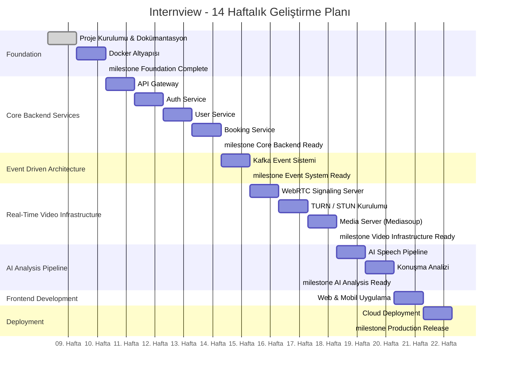

# Development Roadmap

## 7.1 Project Timeline

Internview 14 haftalık yoğunlaştırılmış bir geliştirme takvimi ile hayata geçirilmektedir. Plan, altyapı hazırlığından production deployment'a kadar sistematik bir ilerleme hedefler.

---

## 7.2 Milestones

### Milestone 1 — Foundation & Infrastructure (Hafta 1–2)

| Hafta | Hedef | Deliverables |
|-------|-------|-------------|
| **Hafta 1** | Proje Kurulumu & Dokümantasyon | Skeleton Spring Boot backend, Next.js web, Flutter mobile projeleri. Monorepo klasör iskeleti. Tüm teknik dokümanlar (system architecture, tech stack, domain model, API design, event architecture, WebRTC flow, roadmap). |
| **Hafta 2** | Docker Altyapısı | PostgreSQL, Redis, Apache Kafka (KRaft), HashiCorp Consul Docker Compose yapılandırması. Backend entegrasyon ping testi. |

### Milestone 2 — Core Backend Services (Hafta 3–6)

| Hafta | Hedef | Deliverables |
|-------|-------|-------------|
| **Hafta 3** | API Gateway | Spring Cloud Gateway kurulumu, route yapılandırması, loglama, basic auth filter. |
| **Hafta 4** | Auth Service | Spring Security + JWT entegrasyonu. Register, login, token refresh endpoint'leri. |
| **Hafta 5** | User Service | Aday/uzman profil CRUD, yetenek ve sektör bazlı filtreleme, pagination. |
| **Hafta 6** | Booking Service | Availability slot yönetimi, randevu oluşturma. **Redis distributed lock** ile çifte rezervasyon engelleme. |

### Milestone 3 — Event-Driven Communication (Hafta 7)

| Hafta | Hedef | Deliverables |
|-------|-------|-------------|
| **Hafta 7** | Kafka Event Sistemi | Spring Kafka Producer/Consumer entegrasyonu. BookingCreatedEvent ve InterviewCompletedEvent topic'lerinin kurulumu. |

### Milestone 4 — Real-Time Video Infrastructure (Hafta 8–10)

| Hafta | Hedef | Deliverables |
|-------|-------|-------------|
| **Hafta 8** | WebRTC Signaling Server | Spring WebSocket sunucusu, Redis ile oda state yönetimi, SDP Offer/Answer ve ICE Candidate taşıma. |
| **Hafta 9** | TURN/STUN Kurulumu | Coturn container deployment, mobil ağ simülasyonlarında NAT traversal testleri. |
| **Hafta 10** | Media Server | Mediasoup (SFU) kurulumu, video stream yönlendirme, server-side recording ve S3 upload. |

### Milestone 5 — AI Speech Analysis Pipeline (Hafta 11–12)

| Hafta | Hedef | Deliverables |
|-------|-------|-------------|
| **Hafta 11** | AI Speech Pipeline | Python + OpenAI Whisper modülü, S3'ten video alma, audio extraction, Speech-to-Text dönüşümü. |
| **Hafta 12** | Konuşma Analizi | WPM, duraksama oranı, dolgu kelime tespiti, JSONB formatında PostgreSQL'e kayıt. |

### Milestone 6 — Frontend & Production Deployment (Hafta 13–14)

| Hafta | Hedef | Deliverables |
|-------|-------|-------------|
| **Hafta 13** | Web & Mobil Uygulama | Next.js mülakat odası ekranı, uzman arama/listeleme, randevu takvimi. Flutter mülakat odası, WebRTC entegrasyonu. Login sistemi tam bağlantı. |
| **Hafta 14** | Cloud Deployment | GitHub Actions CI/CD pipeline, AWS EC2 deployment, Docker image build, VPC izolasyonu, production ortamında canlı test. |

---

## 7.3 Weekly Tasks

### Hafta 1 — Proje Kurulumu ve Dokümantasyon

**Amaç:** Design-first yaklaşım ile mimari temel kurulumu

- [x] Spring Boot backend skeleton projesi oluşturma
- [x] Next.js web frontend skeleton projesi oluşturma
- [x] Flutter mobile skeleton projesi oluşturma
- [x] Monorepo klasör yapısının düzenlenmesi
- [x] System Architecture dokümanı
- [x] Tech Stack dokümanı
- [x] Domain Model dokümanı
- [x] API Design dokümanı
- [x] Event Architecture dokümanı
- [x] WebRTC Flow dokümanı
- [x] Development Roadmap dokümanı
- [x] README.md güncellenmesi

### Hafta 2 — Docker Altyapısı

**Amaç:** Geliştirme ortamının konteynerize edilmesi

- [ ] `docker-compose.yml` dosyasının oluşturulması
- [ ] PostgreSQL container yapılandırması
- [ ] Redis container yapılandırması
- [ ] Apache Kafka (KRaft Mode) container yapılandırması
- [ ] HashiCorp Consul container yapılandırması
- [ ] Backend ↔ dış bileşen entegrasyon ping testi
- [ ] `.env` dosyaları ve environment variable yönetimi

### Hafta 3 — API Gateway

- [ ] Spring Cloud Gateway projesi oluşturma
- [ ] Route tanımlamaları (auth, user, booking, interview)
- [ ] Request/response loglama
- [ ] Basic authentication filter
- [ ] Rate limiting yapılandırması

### Hafta 4 — Auth Service

- [ ] Spring Security yapılandırması
- [ ] JWT token üretimi ve doğrulama
- [ ] `POST /auth/register` endpoint
- [ ] `POST /auth/login` endpoint
- [ ] `POST /auth/refresh` endpoint
- [ ] Rol bazlı erişim kontrolü (RBAC)

### Hafta 5 — User Service

- [ ] User entity ve repository katmanı
- [ ] ExpertProfile, Skill, Industry entity'leri
- [ ] `GET /experts` — filtreleme ve pagination
- [ ] `GET /experts/{id}` — uzman detay
- [ ] `PUT /users/profile` — profil güncelleme
- [ ] Unit testler

### Hafta 6 — Booking Service

- [ ] AvailabilitySlot CRUD operasyonları
- [ ] `POST /bookings` — randevu oluşturma
- [ ] Redis distributed lock implementasyonu
- [ ] Çifte rezervasyon senaryosu testleri
- [ ] Booking durum yönetimi (state machine)

### Hafta 7 — Kafka Event Sistemi

- [ ] Spring Kafka Producer yapılandırması
- [ ] Spring Kafka Consumer yapılandırması
- [ ] `BookingCreatedEvent` topic ve handler
- [ ] `InterviewCompletedEvent` topic ve handler
- [ ] Event serialization/deserialization (JSON)

### Hafta 8 — WebRTC Signaling Server

- [ ] Spring WebSocket sunucusu kurulumu
- [ ] Oda (room) yönetimi
- [ ] Redis ile oda state paylaşımı
- [ ] SDP Offer/Answer mesaj taşıma
- [ ] ICE Candidate mesaj taşıma
- [ ] WebSocket bağlantı testleri

### Hafta 9 — TURN/STUN Kurulumu

- [ ] Coturn Docker container yapılandırması
- [ ] STUN server konfigürasyonu
- [ ] TURN server konfigürasyonu (credential management)
- [ ] Farklı ağ koşullarında bağlantı testleri
- [ ] Mobil ağ (4G/5G) simülasyonu testleri

### Hafta 10 — Media Server

- [ ] Mediasoup (SFU) sunucu kurulumu
- [ ] Producer/Consumer transport yönetimi
- [ ] Video/audio stream yönlendirme
- [ ] Server-side recording implementasyonu
- [ ] S3'e video upload pipeline

### Hafta 11 — AI Speech Pipeline

- [ ] Python servis yapılandırması
- [ ] S3'ten video dosyası indirme
- [ ] Audio extraction (ffmpeg)
- [ ] OpenAI Whisper STT entegrasyonu
- [ ] Transcript çıktısının doğrulanması

### Hafta 12 — Konuşma Analizi

- [ ] WPM (Words Per Minute) hesaplama
- [ ] Duraksama (Pause) tespiti ve oranı
- [ ] Dolgu kelime (Filler Word) analizi
- [ ] JSONB formatında sonuç kaydetme
- [ ] `AnalysisCompletedEvent` Kafka producer

### Hafta 13 — Web & Mobil Uygulama

- [ ] Next.js: Login/Register sayfaları
- [ ] Next.js: Uzman arama ve listeleme
- [ ] Next.js: Randevu takvimi
- [ ] Next.js: Mülakat odası (WebRTC)
- [ ] Flutter: Login/Register ekranları
- [ ] Flutter: Uzman arama ve listeleme
- [ ] Flutter: Randevu takvimi
- [ ] Flutter: Mülakat odası (flutter_webrtc)
- [ ] API entegrasyonu ve end-to-end testler

### Hafta 14 — Cloud Deployment

- [ ] Dockerfile'lar (her servis için)
- [ ] GitHub Actions CI pipeline (build + test)
- [ ] GitHub Actions CD pipeline (deploy)
- [ ] AWS EC2 instance provisioning
- [ ] VPC ve Security Group yapılandırması
- [ ] S3 bucket yapılandırması
- [ ] Production ortamında smoke test
- [ ] DNS ve SSL yapılandırması

---

## 7.4 Risks & Mitigations

| Risk | Etkisi | Olasılık | Azaltma Stratejisi |
|------|--------|----------|-------------------|
| **WebRTC Complexity** | Video bağlantı sorunları, platform farklılıkları | Yüksek | Mediasoup SFU ile merkezi kontrol; Coturn ile NAT traversal güvencesi; erken prototip testleri |
| **AI Model Integration** | Whisper model boyutu, işlem süresi, doğruluk | Orta | Model boyutunu optimize etme (small/medium); asenkron pipeline ile kullanıcı bekletmeme |
| **Distributed System Debugging** | Servisler arası hata tespiti zorluğu | Orta | Centralized logging, correlation ID ile request tracing, health check endpoint'leri |
| **Double Booking** | Aynı slot'a eşzamanlı erişim | Yüksek | Redis distributed lock ile atomik operasyon; pessimistic lock fallback |
| **Cloud Deployment** | Konfigürasyon hataları, maliyet kontrolü | Orta | Docker Compose ile lokal/prod paritesi; IaC (Infrastructure as Code) yaklaşımı; budget alertleri |
| **Cross-Platform Uyumluluk** | Flutter ve Web arasında WebRTC davranış farkları | Orta | Platform spesifik adaptör katmanı; erken entegrasyon testleri |
| **Kafka Operasyonel Karmaşıklık** | Topic yönetimi, consumer lag, partition dengeleme | Düşük | Monitoring dashboard; dead letter queue; consumer group stratejisi |
