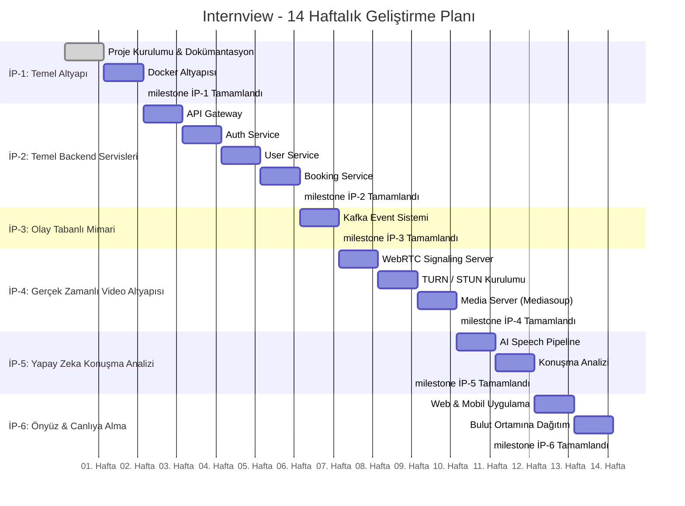

# Geliştirme Yol Haritası

## Proje Zaman Çizelgesi

Internview, 14 haftalık yoğunlaştırılmış bir geliştirme takvimi ile hayata geçirilmektedir. Plan, altyapı hazırlığından canlı ortama geçişe kadar 6 iş paketi altında sistematik bir ilerleme hedefler.

---

## İş Paketleri

---

### İP-1: Temel Altyapı ve Proje Kurulumu

| | |
|---|---|
| **Süre** | Hafta 1 – 2 (2 hafta) |
| **Amaç** | Projenin iskelet yapısının oluşturulması, teknik dokümantasyonun tamamlanması ve geliştirme ortamının konteynerize edilmesi. |
| **Çıktılar** | Skeleton Spring Boot backend, Next.js web, Flutter mobile projeleri. Monorepo klasör iskeleti. Tüm teknik dokümanlar. Docker Compose ile PostgreSQL, Redis, Kafka (KRaft), Consul altyapısı. |

#### Hafta 1 — Proje Kurulumu ve Dokümantasyon

**Amaç:** Design-first yaklaşım ile mimari temel kurulumu

- [X] Spring Boot backend skeleton projesi oluşturma
- [X] Next.js web frontend skeleton projesi oluşturma
- [X] Flutter mobile skeleton projesi oluşturma
- [X] Monorepo klasör yapısının düzenlenmesi
- [X] System Architecture dokümanı
- [X] Tech Stack dokümanı
- [X] Domain Model dokümanı
- [X] API Design dokümanı
- [X] Event Architecture dokümanı
- [X] WebRTC Flow dokümanı
- [X] Development Roadmap dokümanı
- [X] README.md güncellenmesi

#### Hafta 2 — Docker Altyapısı

**Amaç:** Geliştirme ortamının konteynerize edilmesi

- [X] `docker-compose.yml` dosyasının oluşturulması
- [X] PostgreSQL container yapılandırması
- [X] Redis container yapılandırması
- [X] Apache Kafka (KRaft Mode) container yapılandırması
- [X] HashiCorp Consul container yapılandırması
- [X] Backend ↔ dış bileşen entegrasyon ping testi
- [X] `.env` dosyaları ve environment variable yönetimi

---

### İP-2: Temel Backend Servisleri

| | |
|---|---|
| **Süre** | Hafta 3 – 6 (4 hafta) |
| **Amaç** | API Gateway, kimlik doğrulama, kullanıcı yönetimi ve randevu sisteminin geliştirilmesi. |
| **Çıktılar** | Spring Cloud Gateway, JWT tabanlı Auth Service, kullanıcı profil CRUD, Redis distributed lock ile çifte rezervasyona dayanıklı Booking Service. |

#### Hafta 3 — API Gateway

- [X] Spring Cloud Gateway projesi oluşturma
- [X] Route tanımlamaları (auth, user, booking, interview)
- [X] Request/response loglama
- [X] Basic authentication filter
- [X] Rate limiting yapılandırması

#### Hafta 4 — Auth Service

- [ ] Spring Security yapılandırması
- [ ] JWT token üretimi ve doğrulama
- [ ] `POST /auth/register` endpoint
- [ ] `POST /auth/login` endpoint
- [ ] `POST /auth/refresh` endpoint
- [ ] Rol bazlı erişim kontrolü (RBAC)

#### Hafta 5 — User Service

- [ ] User entity ve repository katmanı
- [ ] ExpertProfile, Skill, Industry entity'leri
- [ ] `GET /experts` — filtreleme ve pagination
- [ ] `GET /experts/{id}` — uzman detay
- [ ] `PUT /users/profile` — profil güncelleme
- [ ] Unit testler

#### Hafta 6 — Booking Service

- [ ] AvailabilitySlot CRUD operasyonları
- [ ] `POST /bookings` — randevu oluşturma
- [ ] Redis distributed lock implementasyonu
- [ ] Çifte rezervasyon senaryosu testleri
- [ ] Booking durum yönetimi (state machine)

---

### İP-3: Olay Tabanlı Mimari

| | |
|---|---|
| **Süre** | Hafta 7 (1 hafta) |
| **Amaç** | Servisler arası asenkron iletişim altyapısının kurulması. |
| **Çıktılar** | Spring Kafka Producer/Consumer entegrasyonu, BookingCreatedEvent ve InterviewCompletedEvent topic'leri. |

#### Hafta 7 — Kafka Event Sistemi

- [ ] Spring Kafka Producer yapılandırması
- [ ] Spring Kafka Consumer yapılandırması
- [ ] `BookingCreatedEvent` topic ve handler
- [ ] `InterviewCompletedEvent` topic ve handler
- [ ] Event serialization/deserialization (JSON)

---

### İP-4: Gerçek Zamanlı Video Altyapısı

| | |
|---|---|
| **Süre** | Hafta 8 – 10 (3 hafta) |
| **Amaç** | WebRTC tabanlı gerçek zamanlı görüntülü görüşme altyapısının kurulması; sinyal sunucusu, NAT traversal ve medya sunucusu bileşenlerinin geliştirilmesi. |
| **Çıktılar** | Spring WebSocket signaling server, Coturn TURN/STUN yapılandırması, Mediasoup SFU ile video yönlendirme ve server-side recording. |

#### Hafta 8 — WebRTC Signaling Server

- [ ] Spring WebSocket sunucusu kurulumu
- [ ] Oda (room) yönetimi
- [ ] Redis ile oda state paylaşımı
- [ ] SDP Offer/Answer mesaj taşıma
- [ ] ICE Candidate mesaj taşıma
- [ ] WebSocket bağlantı testleri

#### Hafta 9 — TURN/STUN Kurulumu

- [ ] Coturn Docker container yapılandırması
- [ ] STUN server konfigürasyonu
- [ ] TURN server konfigürasyonu (credential management)
- [ ] Farklı ağ koşullarında bağlantı testleri
- [ ] Mobil ağ (4G/5G) simülasyonu testleri

#### Hafta 10 — Media Server

- [ ] Mediasoup (SFU) sunucu kurulumu
- [ ] Producer/Consumer transport yönetimi
- [ ] Video/audio stream yönlendirme
- [ ] Server-side recording implementasyonu
- [ ] S3'e video upload pipeline

---

### İP-5: Yapay Zeka Konuşma Analizi

| | |
|---|---|
| **Süre** | Hafta 11 – 12 (2 hafta) |
| **Amaç** | Mülakat kayıtlarından otomatik konuşma analizi yapan yapay zeka pipeline'ının geliştirilmesi. |
| **Çıktılar** | Python + OpenAI Whisper ile Speech-to-Text dönüşümü, WPM / duraksama / dolgu kelime analizi, JSONB formatında PostgreSQL'e kayıt. |

#### Hafta 11 — AI Speech Pipeline

- [ ] Python servis yapılandırması
- [ ] S3'ten video dosyası indirme
- [ ] Audio extraction (ffmpeg)
- [ ] OpenAI Whisper STT entegrasyonu
- [ ] Transcript çıktısının doğrulanması

#### Hafta 12 — Konuşma Analizi

- [ ] WPM (Words Per Minute) hesaplama
- [ ] Duraksama (Pause) tespiti ve oranı
- [ ] Dolgu kelime (Filler Word) analizi
- [ ] JSONB formatında sonuç kaydetme
- [ ] `AnalysisCompletedEvent` Kafka producer

---

### İP-6: Önyüz Geliştirme ve Canlıya Alma

| | |
|---|---|
| **Süre** | Hafta 13 – 14 (2 hafta) |
| **Amaç** | Web ve mobil önyüz uygulamalarının geliştirilmesi, tüm sistemin bulut ortamına dağıtılması ve canlı testlerin yapılması. |
| **Çıktılar** | Next.js web uygulaması, Flutter mobil uygulama, GitHub Actions CI/CD, AWS EC2 deployment, production smoke test. |

#### Hafta 13 — Web ve Mobil Uygulama

- [ ] Next.js: Login/Register sayfaları
- [ ] Next.js: Uzman arama ve listeleme
- [ ] Next.js: Randevu takvimi
- [ ] Next.js: Mülakat odası (WebRTC)
- [ ] Flutter: Login/Register ekranları
- [ ] Flutter: Uzman arama ve listeleme
- [ ] Flutter: Randevu takvimi
- [ ] Flutter: Mülakat odası (flutter_webrtc)
- [ ] API entegrasyonu ve end-to-end testler

#### Hafta 14 — Bulut Ortamına Dağıtım

- [ ] Dockerfile'lar (her servis için)
- [ ] GitHub Actions CI pipeline (build + test)
- [ ] GitHub Actions CD pipeline (deploy)
- [ ] AWS EC2 instance provisioning
- [ ] VPC ve Security Group yapılandırması
- [ ] S3 bucket yapılandırması
- [ ] Production ortamında smoke test
- [ ] DNS ve SSL yapılandırması

---

## Riskler ve Önlemler

| Risk | Etkisi | Olasılık | Azaltma Stratejisi |
|------|--------|----------|-------------------|
| **WebRTC Karmaşıklığı** | Video bağlantı sorunları, platform farklılıkları | Yüksek | Mediasoup SFU ile merkezi kontrol; Coturn ile NAT traversal güvencesi; erken prototip testleri |
| **Yapay Zeka Model Entegrasyonu** | Whisper model boyutu, işlem süresi, doğruluk | Orta | Model boyutunu optimize etme (small/medium); asenkron pipeline ile kullanıcı bekletmeme |
| **Dağıtık Sistem Hata Ayıklama** | Servisler arası hata tespiti zorluğu | Orta | Merkezi loglama, correlation ID ile istek takibi, health check endpoint'leri |
| **Çifte Rezervasyon** | Aynı slot'a eşzamanlı erişim | Yüksek | Redis distributed lock ile atomik operasyon; pessimistic lock fallback |
| **Bulut Dağıtımı** | Konfigürasyon hataları, maliyet kontrolü | Orta | Docker Compose ile lokal/prod paritesi; IaC yaklaşımı; bütçe uyarıları |
| **Platformlar Arası Uyumluluk** | Flutter ve Web arasında WebRTC davranış farkları | Orta | Platform spesifik adaptör katmanı; erken entegrasyon testleri |
| **Kafka Operasyonel Karmaşıklık** | Topic yönetimi, consumer lag, partition dengeleme | Düşük | İzleme panosu; dead letter queue; consumer group stratejisi |
