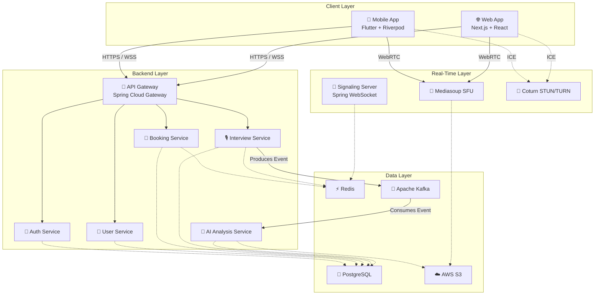
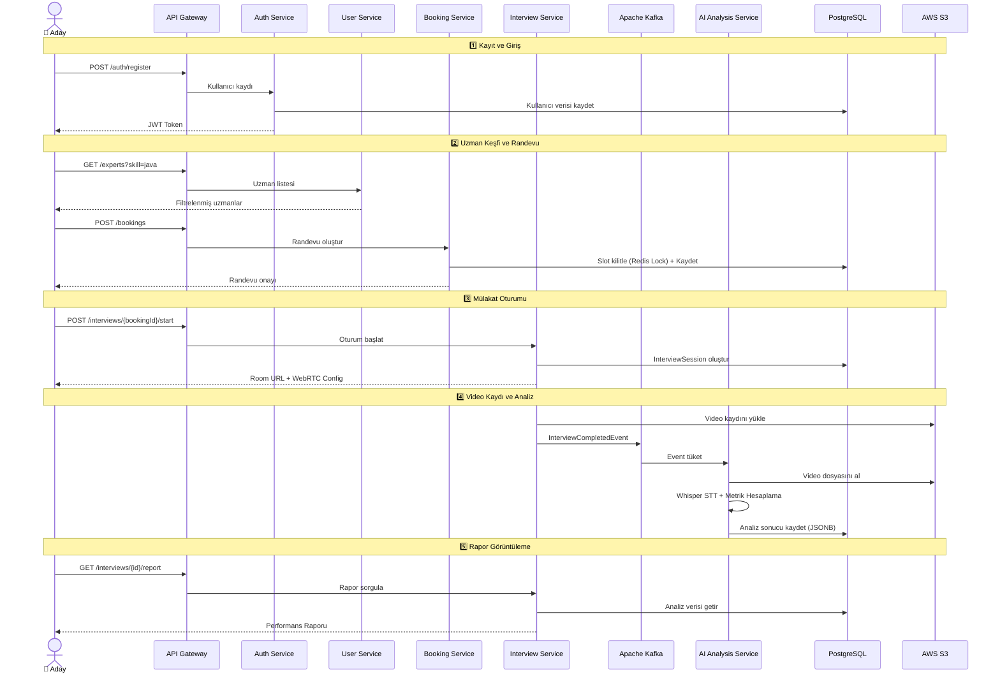
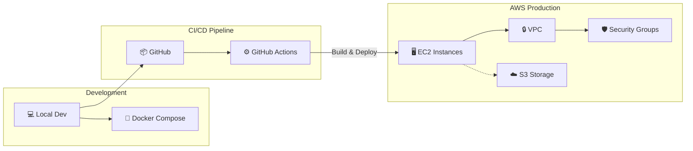

# System Architecture

## 1.1 Introduction

Internview, adayların ve alanında uzman profesyonellerin bir araya gelerek gerçek zamanlı, yüksek kaliteli mock mülakat deneyimi yaşayabilecekleri bir SaaS platformudur.

### Problem

Geleneksel mülakat hazırlığı tek taraflıdır: adaylar ya kendi kendilerine pratik yapar ya da çevresindeki kişilerden geri bildirim alır. Bu süreç objektif metriklerden yoksundur, ölçeklenemez ve gerçek mülakat baskısını simüle edemez.

### Çözüm

Internview, üç temel katmanı birleştirerek bu problemi çözer:

1. **Uzman Eşleme Motoru** — Adaylar, sektör ve yetenek bazlı filtreleme ile doğru uzmanı bulur ve uygun zaman dilimlerinde randevu oluşturur.
2. **Gerçek Zamanlı Video Mülakat** — WebRTC tabanlı altyapı sayesinde düşük gecikmeli, kesintisiz bir video görüşme deneyimi sağlanır.
3. **AI Destekli Performans Analizi** — Yapay zeka, mülakat kaydını analiz ederek konuşma hızı, duraksama oranı ve dolgu kelime kullanımı gibi metrikleri hesaplar.

### Hedef Kullanıcılar

| Kullanıcı Tipi | Açıklama |
|----------------|----------|
| **Aday (Candidate)** | İş mülakatlarına hazırlanan, objektif geri bildirim arayan profesyoneller ve öğrenciler |
| **Uzman (Expert)** | Belirli sektör ve pozisyonlarda mülakat deneyimine sahip, mentörlük yapabilecek profesyoneller |

---

## 1.2 High-Level Architecture

Sistem dört temel katmandan oluşur. Her katman bağımsız olarak ölçeklenebilir ve birbirinden izole edilmiştir.

### Katman Açıklamaları

| Katman | Sorumluluk | Teknolojiler |
|--------|-----------|-------------|
| **Client Layer** | Kullanıcı arayüzü, WebRTC peer bağlantısı | Flutter, Next.js, React |
| **Backend Layer** | İş mantığı, kimlik doğrulama, veri yönetimi | Spring Boot, Spring Cloud, Java 21 |
| **Real-Time Layer** | Video/ses iletimi, sinyal sunucusu, NAT traversal | WebRTC, Mediasoup, Coturn |
| **Data Layer** | Kalıcı depolama, önbellekleme, olay akışı | PostgreSQL, Redis, Kafka, S3 |

---

## 1.3 System Components

### Auth Service

Kullanıcı kimlik doğrulama ve yetkilendirme süreçlerini yönetir.

- **Teknoloji:** Spring Security + JWT (JSON Web Token)
- **Sorumluluklar:**
  - Kullanıcı kaydı (Register) ve giriş (Login)
  - JWT token üretimi ve doğrulaması
  - Token yenileme (Refresh Token) mekanizması
  - Rol bazlı erişim kontrolü (CANDIDATE / EXPERT / ADMIN)

### User Service

Kullanıcı ve uzman profil verilerini yönetir.

- **Teknoloji:** Spring Boot + PostgreSQL
- **Sorumluluklar:**
  - Aday profil bilgileri (biyografi, deneyim)
  - Uzman profil bilgileri (uzmanlık alanları, sektörler, değerlendirme puanı)
  - Yetenek (Skill) ve sektör (Industry) bazlı filtreleme
  - Uzman arama ve listeleme (Pagination destekli)

### Booking Service

Randevu oluşturma, takvim yönetimi ve çifte rezervasyon engellemesini sağlar.

- **Teknoloji:** Spring Boot + PostgreSQL + Redis (Distributed Lock)
- **Sorumluluklar:**
  - Uzman müsaitlik aralıkları (Availability Slot) yönetimi
  - Aday tarafından randevu oluşturma
  - **Çifte rezervasyon engelleme:** Redis distributed lock mekanizması ile aynı slot'a eşzamanlı erişim önlenir
  - Randevu durumu yönetimi (PENDING → CONFIRMED → COMPLETED / CANCELLED)

### Interview Service

Mülakat oturumlarının yaşam döngüsünü yönetir.

- **Teknoloji:** Spring Boot + Redis + Kafka Producer
- **Sorumluluklar:**
  - Mülakat oturumu başlatma ve sonlandırma
  - WebRTC oda (room) bilgilerinin oluşturulması
  - Oturum süresinin ve durumunun takibi
  - Mülakat tamamlandığında `InterviewCompletedEvent` üretimi (Kafka)

### AI Analysis Service

Mülakat kayıtlarını analiz ederek performans raporu oluşturur.

- **Teknoloji:** Python + OpenAI Whisper + PostgreSQL
- **Sorumluluklar:**
  - S3'ten video/ses dosyasının alınması
  - Speech-to-Text dönüşümü (OpenAI Whisper)
  - Konuşma metrikleri hesaplama:
    - **WPM (Words Per Minute):** Konuşma hızı
    - **Pause Rate:** Duraksama oranı
    - **Filler Word Rate:** Dolgu kelime kullanım sıklığı
  - Analiz sonuçlarının JSONB formatında PostgreSQL'e kaydedilmesi

---

## 1.4 Data Flow

Aşağıdaki senaryo, bir adayın sisteme kaydolmasından mülakat analiz raporunu almasına kadarki uçtan uca veri akışını gösterir.

---

## 1.5 Scalability Considerations

| Strateji | Açıklama | Uygulama |
|----------|----------|----------|
| **Microservice Architecture** | Her servis bağımsız deploy edilir, bağımsız ölçeklenir | Spring Boot modüler servisler |
| **Event-Driven Decoupling** | Servisler arası sıkı bağımlılık yerine asenkron olay akışı | Apache Kafka topic'leri ile gevşek bağlama |
| **Stateless Backend** | Oturum verisi sunucuda tutulmaz, JWT ile tanınır | Her istek kendi context'ini taşır |
| **Horizontal Scaling** | Yük artışında servis replika sayısı artırılır | Docker container orchestration |
| **Distributed Caching** | Sık erişilen veriler bellekte tutularak DB yükü azaltılır | Redis cache layer |
| **Distributed Lock** | Eşzamanlı erişim kontrolü merkezi lock mekanizmasıyla sağlanır | Redis distributed lock (Booking) |

---

## 1.6 Deployment Overview

| Ortam | Araç | Açıklama |
|-------|------|----------|
| **Lokal Geliştirme** | Docker Compose | PostgreSQL, Redis, Kafka ve tüm servislerin tek komutla ayağa kaldırılması |
| **Versiyon Kontrol** | Git + GitHub | Branch stratejisi, PR review süreci |
| **CI/CD** | GitHub Actions | Otomatik build, test ve deployment pipeline |
| **Cloud** | AWS (EC2, S3, VPC) | Production ortamı, VPC izolasyonu, Security Groups ile ağ güvenliği |
| **Containerization** | Docker | Her servis bağımsız container olarak paketlenir |
