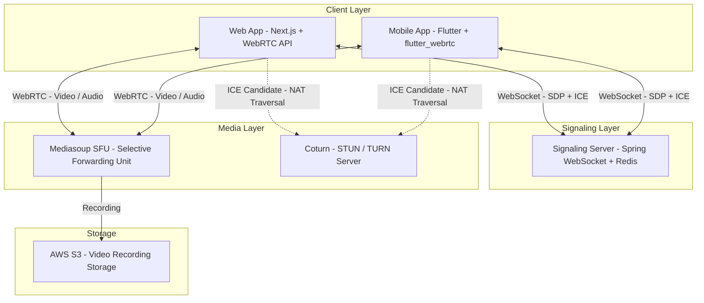
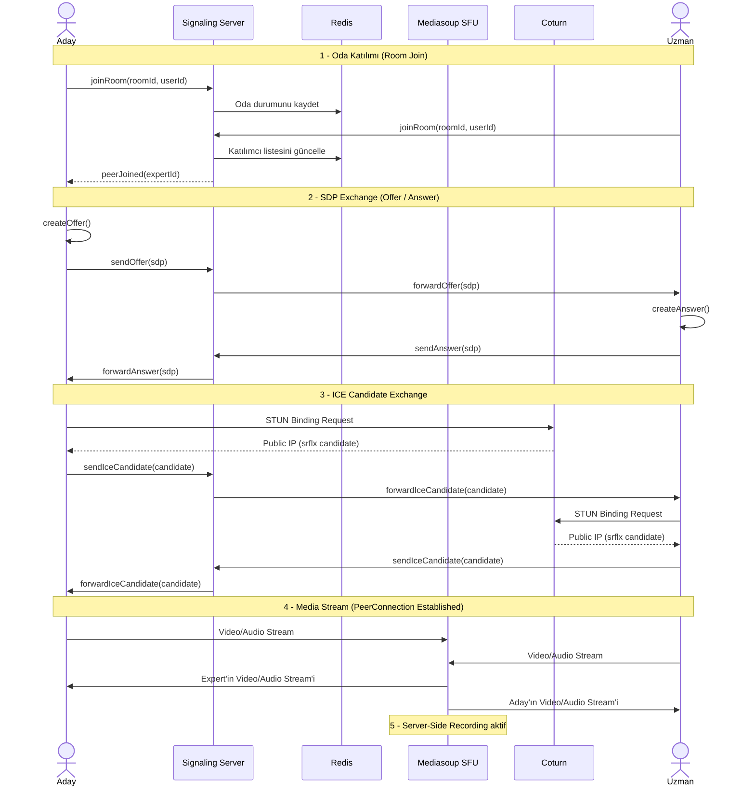
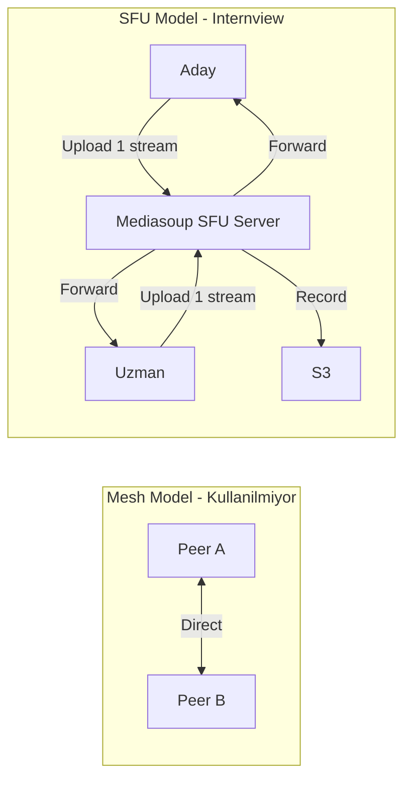
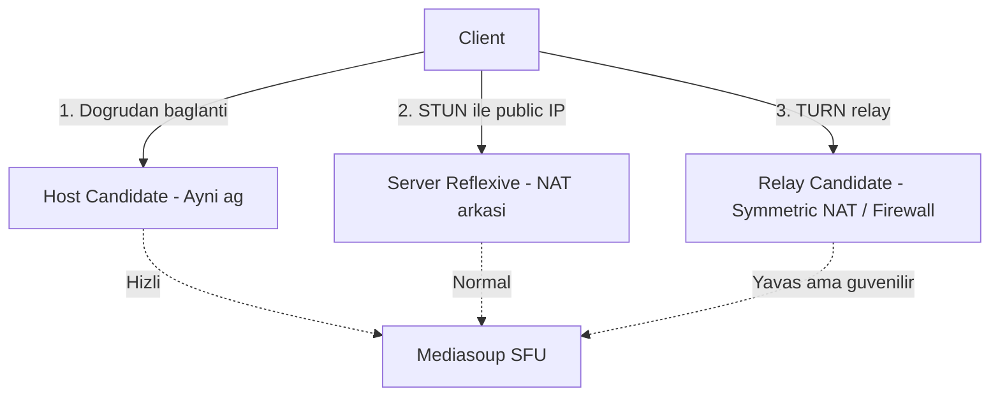

# WebRTC Flow

## 6.1 WebRTC Overview

WebRTC (Web Real-Time Communication), tarayıcılar ve mobil uygulamalar arasında eklenti gerektirmeden düşük gecikmeli, peer-to-peer video ve ses iletişimi sağlayan açık kaynak bir protokoldür.

### Neden WebRTC?

| Özellik | Açıklama |
|---------|----------|
| **Low Latency** | UDP tabanlı medya iletimi ile <200ms gecikme süresi |
| **No Plugin Required** | Modern tarayıcılar ve mobil platformlarda native destek |
| **Encryption** | SRTP ile uçtan uca şifreli medya iletimi |
| **Adaptive Quality** | Bant genişliğine göre otomatik kalite ayarlama |

### Internview'de Kullanım

Adaylar ve uzmanlar, randevu saati geldiğinde platform üzerinden **doğrudan video mülakat** gerçekleştirir. Bu süreçte:

- **Mediasoup (SFU)** üzerinden medya yönlendirmesi yapılır
- **Sunucu tarafında kayıt** alınarak AI analizi için S3'e yüklenir
- **Coturn (STUN/TURN)** ile farklı ağ koşullarında bağlantı güvencesi sağlanır

---

## 6.2 System Components

### Bileşen Detayları

| Bileşen | Teknoloji | Sorumluluk |
|---------|-----------|-----------|
| **Client** | Next.js (Web) / Flutter (Mobile) | Kamera/mikrofon erişimi, PeerConnection yönetimi, UI |
| **Signaling Server** | Spring WebSocket + Redis | SDP Offer/Answer ve ICE Candidate mesajlarının taşınması |
| **SFU (Media Server)** | Mediasoup | Video/ses paketlerinin selektif yönlendirilmesi, sunucu tarafında kayıt |
| **STUN Server** | Coturn | Client'ın public IP adresini keşfetmesi |
| **TURN Server** | Coturn | NAT traversal mümkün olmadığında relay bağlantısı sağlama |

---

## 6.3 Connection Flow

Aşağıdaki diyagram, iki katılımcının mülakat odasına girip video bağlantısı kurmasına kadarki tam sinyal akışını gösterir.

### Adım Adım Açıklama

| Adım | İşlem | Açıklama |
|------|-------|----------|
| **1. Room Join** | WebSocket bağlantısı | Her iki katılımcı signaling server'a bağlanır; oda durumu Redis'te tutulur |
| **2. SDP Exchange** | Offer / Answer | Aday SDP Offer üretir - Signaling Server - Uzman. Uzman SDP Answer üretir - geri yollar |
| **3. ICE Candidates** | NAT Traversal | Her iki taraf kendi public IP'lerini bulur (STUN) ve Signaling Server üzerinden paylaşır |
| **4. Media Stream** | PeerConnection | WebRTC bağlantısı kurulur; medya akışı Mediasoup SFU üzerinden yönlendirilir |
| **5. Recording** | Server-side kayıt | Mediasoup, medya akışını kaydeder ve S3'e yükler |

---

## 6.4 Media Flow

### SFU (Selective Forwarding Unit) Model

Internview, doğrudan peer-to-peer (mesh) bağlantı yerine **Mediasoup SFU** modeli kullanır. Bu model iki temel avantaj sağlar:

| Özellik | Mesh (P2P) | SFU (Mediasoup) |
|---------|-----------|----------------|
| **Server-Side Recording** | Mümkün değil | Sunucuda kayıt alınabilir |
| **Bandwidth Adaptation** | Client yönetir | Simulcast/SVC ile dinamik kalite |
| **NAT Traversal** | Zor | Daha kolay (SFU merkezi nokta) |
| **AI Analiz Uyumluluğu** | Video kaydı client'ta | Video doğrudan S3'e aktarılır |

### Codec Desteği

| Tip | Codec | Açıklama |
|-----|-------|----------|
| **Video** | VP8, VP9, H.264 | Tarayıcı ve platform uyumluluğuna göre otomatik seçim |
| **Audio** | Opus | Düşük gecikme, yüksek kalite ses codec'i |

### NAT Traversal Senaryoları

| Senaryo | ICE Candidate Tipi | Açıklama |
|---------|-------------------|----------|
| **Aynı ağda** | Host | En hızlı; doğrudan local IP ile bağlantı |
| **Farklı ağlarda (NAT)** | Server Reflexive (srflx) | STUN ile public IP keşfedilerek bağlantı |
| **Kısıtlayıcı firewall** | Relay | TURN sunucusu üzerinden tüm trafiğin yönlendirilmesi |
